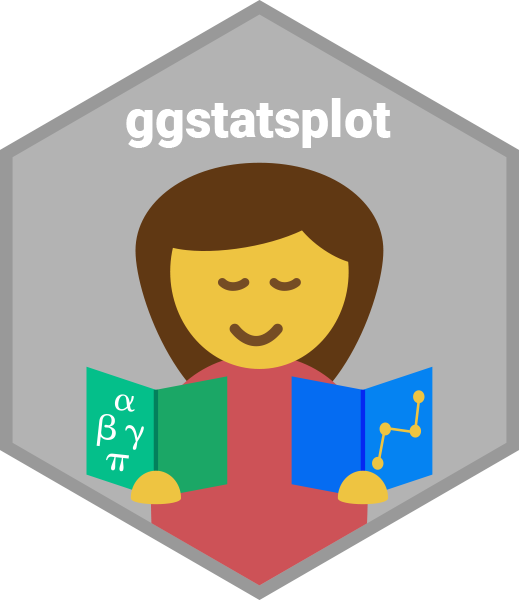

# Introduction to `{ggstatsplot}`: `{ggplot2}` Plots with Statistics

This is a repository for presentation about the
[`{ggstatsplot}`](https://indrajeetpatil.github.io/ggstatsplot/) package (prepared
using R package [{xaringan}](https://github.com/yihui/xaringan)).

[](https://indrajeetpatil.github.io/ggstatsplot_slides/slides/ggstatsplot_presentation.html#1)

The slides are available here:<br>
<https://indrajeetpatil.github.io/ggstatsplot_slides/slides/ggstatsplot_presentation.html#1>

There is also a dedicated website for this package:<br>
<https://indrajeetpatil.github.io/ggstatsplot/>

## Setup

You will need to install the following package-

```r
install.packages("ggstatsplot")
```

## Versions

These slides are from presentations given at various events:

  - **Abuja R User Group**, online talk, February, 26, 2022.

  - **Social Psychology online colloquium series**, Tilburg University,
    Netherlands, March, 19, 2021.

  - **Department of Decision Neuroscience and Nutrition**, German Institute of
    Human Nutrition Potsdam-Rehbruecke, online talk, March, 2, 2021.

  - **Oslo useR! Group**, online talk, February, 18, 2021.

  - **R-Ladies Tunis**, online talk, December, 15, 2020.

  - **Methods Talk series** (Psychology Department, New York University), NYC,
    NY, March, 28, 2019.

  - **Greater Boston useR Group meeting**, Boston, MA, March, 26, 2019.

  - **Harvard Psych Method Dinners**, William James Hall, Harvard University,
    Cambridge, MA, USA, February 5, 2019.
