<style type="text/css">
body, td {
  font-size: 16px;
}
code.r{
  font-size: 14px;
}
</style>

```{r setup, include = FALSE}
knitr::opts_chunk$set(
  fig.width = 7, fig.height = 5, fig.retina = 2, fig.align = "center",
  out.width = "100%", dpi = 300,
  message = FALSE, warning = FALSE, cache = TRUE,
  autodep = TRUE, hiline = TRUE
)

knitr::opts_hooks$set(fig.callout = function(options) {
  if (options$fig.callout) {
    options$echo <- FALSE
    options$out.height <- "99%"
    options$fig.width <- 16
    options$fig.height <- 8
  }
  options
})

options(
  htmltools.dir.version = FALSE,
  width = 90,
  max.print = 9999,
  knitr.table.format = "html",
  crayon.enabled = TRUE
)

as_table <- function(...) knitr::kable(..., format = "html", digits = 3)
```

---

layout: true

**Plan**

---

- Why *ggstatsplot*?

- Current functions

- Benefits and scalability

- Limitations

---

layout: false

class: inverse, center, middle

# Why *ggstatsplot*?

---

layout: true

# Raison d'être

---

--

.right-column[.font150[
Current count of number of packages on the Comprehensive R Archive Network (**CRAN**)<br>
**> 13,000**
]
.footnote[<https://cran.r-project.org/web/packages/>]
]

--

.left-column[

]

--

.right-column[.font150[
Short answer: `ggstatsplot` provides a collection of <font color="blue">*information-rich*</font> plots with <font color="blue">*statistical details*</font> and is suitable for scholarly publications and quick (exploratory) statistical analysis.
]
]

---

layout: true

# 1. Simpler data analysis workflow

---

--

.img-center[

]

--

<br>
<br>
<br>
<br>
<br>
<br>
<br>
<br>
In a typical *exploratory* data analysis workflow, <font color="blue">*data visualization*</font> and <font color="blue">*statistical modelling*</font> are two different phases: visualization informs modelling,
and modelling in its turn can suggest a different visualization method, and so
on and so forth. 

.footnote[(Grolemund & Wickham, *R for Data Science*, 2017)]

--

The central idea of **ggstatsplot** is simple: combine these two phases into one
in the form of graphics with statistical details, which makes data exploration
simpler and faster.

---

layout: true

# 2. Information-rich graphic is worth a thousand words

---

--

.img-center[

]


.footnote[(Matejka & Fitzmaurice, *Autodesk Research*, 2017)]

--

<br>
<br>
<br>
<br>
<br>
<br>
<br>
<br>
<br>
<br>
<br>
.font150[“I plotted my data and what I found will surprise me! - BuzzFeed”]

---

layout: false

# 3. Ready-made plot = no customization

--

The **grammar of graphics** (implemented in `ggplot2`) is an incredibly powerful
framework to prepare graphics and can help you make infinite number of graphics,
each tailored for your specific data visualization problem! But...

--

.pull-left[

]

.pull-right[

]

---

layout: false

# 4. Consistent API

--

```{r lm, eval = FALSE}
stats::lm(formula = wt ~ mpg, data = mtcars)
```

--

```{r cor, eval = FALSE}
stats::cor(x = mtcars$wt, y = mtcars$mpg)
```

--

```{r cor.test, eval = FALSE}
stats::cor.test(formula = ~ wt + mpg, data = mtcars)
```

--

.img-right-small[

]

--

<br>
<br>
**All** functions in `ggstatsplot`-

1.  consistently rely on a dataframe (e.g., `data, x, y, ...`)
2.  data is always expected to be in tidy format (Wickham, [2014](https://vita.had.co.nz/papers/tidy-data.pdf))
3.  accept both `"quoted"` and `unquoted` arguments

---

layout: false

# 5. Follows best practices for statistical reporting 

--

 For all statistical tests reported in the plots, the default template abides
by the [APA](https://my.ilstu.edu/~jhkahn/apastats.html) gold standard for
statistical reporting. For example, here are results from Yuen's test for
trimmed means (robust *t*-test):


---

layout: false

class: inverse, center, middle

# Get Started

---

layout: false

# Installation

--

Install the **ggstatsplot** package from 
[CRAN](https://cran.r-project.org/web/packages/ggstatsplot/index.html):

```{r utils, eval = FALSE, tidy = FALSE}
utils::install.packages("ggstatsplot")
```
--

Then you can get the development version of the package from
[Github](https://github.com/IndrajeetPatil/ggstatsplot):

```{r github, eval = FALSE, tidy = FALSE}
library(devtools)
devtools::install_github("IndrajeetPatil/ggstatsplot", dependencies = FALSE)
```

--

Load the needed packages-

```{r load, eval = TRUE, warning=FALSE}
library(ggstatsplot)
library(ggplot2)
```

--

You are recommended to use the [RStudioIDE](https://www.rstudio.com/products/rstudio/), 
but you don't have to.

---

layout: false

class: inverse, center, middle

# ggbetweenstats
For between group/condition comparisons

---

layout: true

# ggbetweenstats - defaults

---

.left-code[
```{r ggbetweenstats_1, eval = FALSE}
ggbetweenstats(
  data = movies_long,
  x = mpaa,
  y = rating,
  type = "p", # default #<<  
  bf.message = TRUE, #<<
  messages = FALSE
)
```

.font80[
Changing the type of test

- `"p"` → **parametric**

- `"np"` → **non-parametric**

- `"r"` → **robust**

- `"bf"` → **bayes factor**
]
]

.right-plot[
```{r ggbetweenstats_1, ref.label = 'ggbetweenstats_1', echo = FALSE}
```
]

---

layout: true

# ggbetweenstats - little code, loads information

---

.left-code[
```{r ggbetweenstats_1_copy, eval = FALSE}
ggbetweenstats(
  data = movies_long,
  x = mpaa,
  y = rating,
  bf.message = TRUE #<<
)
```

.font80[
Default information:

- <font color="orange">statistical details</font>

- <font color="blue">Bayes Factor</font>

- <font color="green">sample sizes</font>

- <font color="red">distribution summary</font>
]
]

.right-plot[
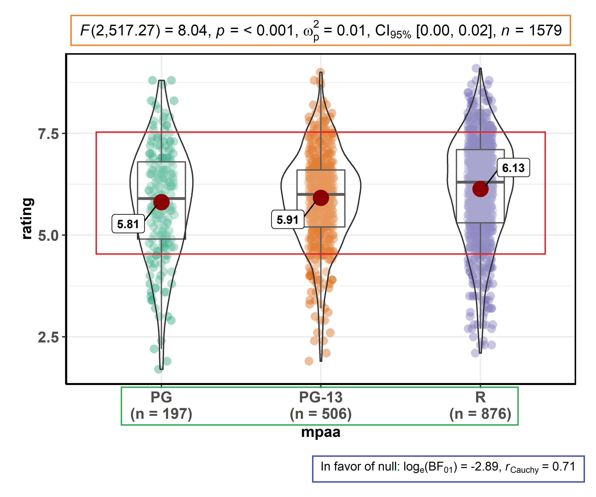
]

---

layout: true

# ggbetweenstats - pairwise comparisons

---

.left-code[
```{r ggbetweenstats_2, eval = FALSE}
ggbetweenstats(
  data = movies_long,
  x = mpaa,
  y = rating,
  type = "np", #<<
  mean.ci = TRUE, #<<
  pairwise.comparisons = TRUE, #<<
  pairwise.display = "ns", #<<
  p.adjust.method = "fdr", #<<
  messages = FALSE
)
```
.font80[
Changing pairwise comparisons displayed

- `"ns"` → only **non-significant**

- `"s"` → only **significant**

- `"all"` → **everything**
]
]

.right-plot[
```{r ggbetweenstats_2, ref.label = 'ggbetweenstats_2', echo = FALSE}
```
]

---

layout: true

# ggbetweenstats - (aesthetic) customization

---

.left-code[
```{r ggbetweenstats_3, eval = FALSE}
ggbetweenstats(
  data = movies_long,
  x = mpaa,
  y = rating,
  type = "r", #<<
  conf.level = 0.99, #<<
  pairwise.comparisons = TRUE,
  pairwise.annotation = "p", 
  outlier.tagging = TRUE, #<<
  outlier.label = title, #<<
  outlier.coef = 2, #<<
  ggtheme = hrbrthemes::theme_ipsum_tw(), #<<
  palette = "Darjeeling2", #<<
  package = "wesanderson", #<<
  messages = FALSE
)
```

.font80[
Aesthetic preferences
are not an excuse to not
use `ggstatsplot` `r emo::ji("heart_eyes_cat")`
]
]

.right-plot[
```{r ggbetweenstats_3, ref.label = 'ggbetweenstats_3', echo = FALSE}
```
]

---

layout: true

# ggbetweenstats - modification with *ggplot2*

---

.left-code[
```{r ggbetweenstats_4, eval = FALSE}
ggbetweenstats(
  data = movies_long,
  x = mpaa,
  y = rating,
  type = "bf", #<<
  messages = FALSE
) + 
  scale_y_continuous(sec.axis = dup_axis()) #<<
```

.font80[
**Note**: You can modify 
all `ggstatsplot` plots further 
using `ggplot2` functions.
Yaay!
]

.img-left-small[

]

]

.right-plot[
```{r ggbetweenstats_4, ref.label = 'ggbetweenstats_4', echo = FALSE}
```
]

---

layout: false

class: inverse, center, middle

# ggwithinstats
For within group/condition comparisons

---

layout: true

# ggwithinstats

---

This function is still under construction. Here is a current draft.

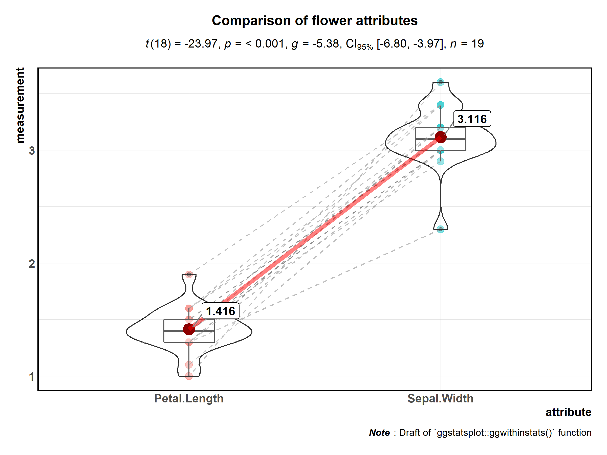

---

layout: false

class: inverse, center, middle

# ggscatterstats
Association between two numeric variables

---

layout: true

# ggscatterstats - defaults

---

.left-code[
```{r ggscatterstats_1, eval = FALSE}
ggscatterstats(
  data = movies_long,
  x = budget,
  y = rating,
  type = "p", # default #<<
  bf.message = TRUE, #<<
  conf.level = 0.99, #<<
  messages = FALSE
)
```

.font80[
Changing the type of test

- `"p"` → **parametric**

- `"np"` → **non-parametric**

- `"r"` → **robust**

- `"bf"` → **bayes factor**
]
]

.right-plot[
```{r ggscatterstats_1, ref.label = 'ggscatterstats_1', echo = FALSE}
```
]

---

layout: true

# ggscatterstats - little code, loads information

---

.left-code[
```{r ggscatterstats_1_copy, eval = FALSE}
ggscatterstats(
  data = movies_long,
  x = budget,
  y = rating,
  bf.message = TRUE,
  conf.level = 0.99
)
```

.font80[
Default information:

- <font color="red">distribution</font>

- <font color="blue">Bayes Factor</font>

- <font color="orange">statistical details</font>
]
]

.right-plot[
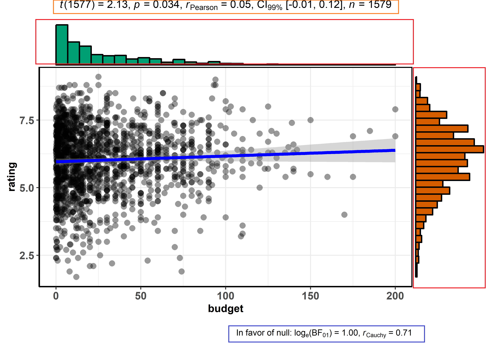
]

---

layout: true

# ggscatterstats - changing smoothing functions

---

.left-code[
```{r ggscatterstats_2, eval = FALSE}
ggscatterstats(
  data = movies_long,
  x = budget,
  y = rating,
  marginal = FALSE, #<<
  method = "loess", #<<
  results.subtitle = FALSE, #<<
  centrality.para = "mean", #<<
  label.var = title, #<<
  label.expression = budget > 150 #<<
                     & rating > 7.5, #<<
  ggtheme = ggthemes::theme_stata(), #<<
  ggstatsplot.layer = FALSE,
  messages = FALSE
)
```

.font80[
Available centrality parameters

- **mean**

- **median**

]
]

.right-plot[
```{r ggscatterstats_2, ref.label = 'ggscatterstats_2', echo = FALSE}
```
]

---

layout: false

class: inverse, center, middle

# ggcorrmat
Association between multiple numeric variables

---

layout: true

# ggcorrmat - defaults

---

.left-code[
```{r ggcorrmat_1, eval = FALSE}
ggcorrmat(dplyr::starwars)
```

.font80[
Changing the type of test

- `"p"` → **parametric**

- `"np"` → **non-parametric**

- `"r"` → **robust**

- `"bf"` → not yet implemented
<br>
<br>
**Note**: Informative label
about sample sizes in case
`NA`s are present.

]
]

.right-plot[
```{r ggcorrmat_1, ref.label = 'ggcorrmat_1', echo = FALSE}
```
]

---

layout: true

# ggcorrmat - little code, loads information

---

.left-code[
```{r ggcorrmat_1_copy, eval = FALSE}
ggcorrmat(dplyr::starwars)
```

.font80[
Default information:

- <font color="red">statistical details</font>

- <font color="blue">sample sizes</font>

- <font color="green">details about test</font>
]
]

.right-plot[
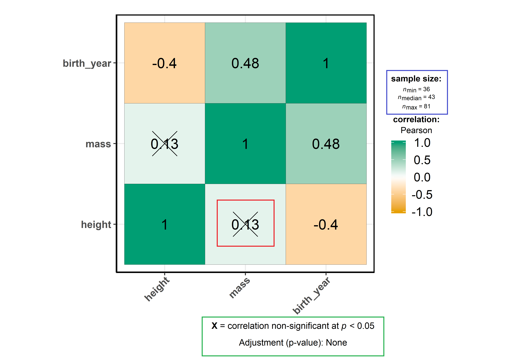
]

---

layout: true

# ggcorrmat - changing defaults

---

.left-code[
```{r ggcorrmat_2, eval = FALSE}
ggcorrmat(
  data = ggplot2::msleep,
  cor.vars = sleep_cycle:bodywt,
  type = "r",
  matrix.type = "upper", #<<
  p.adjust.method = "holm", #<<
  colors = NULL,
  package = "yarrr", #<<
  palette = "southpark" #<<
)
```

.font80[
In addition to `"plot"` as `output`, 
this function can also be used to
get a <font color="blue">dataframe</font> of results:

- `"r"` → **correlation**

- `"p"` → **p-values**

- `"n"` → **sample sizes**

- `"ci"` → **confidence intervals**

]
]

.right-plot[
```{r ggcorrmat_2, ref.label = 'ggcorrmat_2', echo = FALSE}
```
]

---

layout: true

# ggcorrmat - dataframe output example

---

.pull-left[
.font70[
correlation coefficients

```{r ggcorrmat_3}
ggcorrmat(
  data = ggplot2::msleep,
  cor.vars = sleep_cycle:bodywt,
  type = "np", #<<
  output = "r", #<<
  p.adjust.method = "fdr",
  messages = FALSE
)
```
]
]

.pull-right[
.font70[
*p*-values

```{r ggcorrmat_4}
ggcorrmat(
  data = ggplot2::msleep,
  cor.vars = sleep_cycle:bodywt,
  type = "np", #<<
  output = "p", #<<
  p.adjust.method = "none",
  messages = FALSE
)
```
]
]

---

layout: false

class: inverse, center, middle

# gghistostats
Distribution of a numeric variable

---

layout: true

# gghistostats

---

.left-code[
```{r gghistostats_1, eval = FALSE}
gghistostats(
  data = movies_long,    
  x = budget,
  type = "r", #<<
  test.value = 50, #<<
  bar.measure = "count", # default #<<
  binwidth = 10,  #<<
  messages = FALSE
) 
```

.font80[
Changing the type of test

- `"p"` → **parametric**

- `"np"` → **non-parametric**

- `"r"` → **robust**

- `"bf"` → **bayes factor**
]
]

.right-plot[
```{r gghistostats_1, ref.label = 'gghistostats_1', echo = FALSE}
```
]

---

layout: true

# gghistostats - further customization

---

.left-code[
```{r gghistostats_2, eval = FALSE}
gghistostats(
  data = movies_long,    
  x = budget,
  test.value = 50,
  test.value.size = TRUE, #<<
  bar.measure = "mix", #<<
  centrality.para = "median", 
  test.value.line = TRUE, #<<
  normal.curve = TRUE, #<<
  bf.message = TRUE,
  ggtheme = hrbrthemes::theme_ipsum_tw(), #<<
  ggstatsplot.layer = FALSE, #<<
  messages = FALSE
) 
```

.font80[
Available bar measures 

- **count**
- **proportion**
- **both** (of the above)
- **density**

]
]

.right-plot[
```{r gghistostats_2, ref.label = 'gghistostats_2', echo = FALSE}
```
]

---

layout: true

# gghistostats - little code, loads information

---

.left-code[
```{r gghistostats_2_copy, eval = FALSE}
gghistostats(
  data = movies_long,    
  x = budget,
  test.value = 50,
  test.value.size = TRUE, 
  bar.measure = "mix", 
  centrality.para = "median", 
  test.value.line = TRUE,
  normal.curve = TRUE,
  bf.message = TRUE
)
```

.font80[
Default information:

- <font color="orange">statistical details</font>

- <font color="blue">Bayes Factor</font>

- <font color="green">frequency</font>

- <font color="black">distribution summary</font>
]
]

.right-plot[
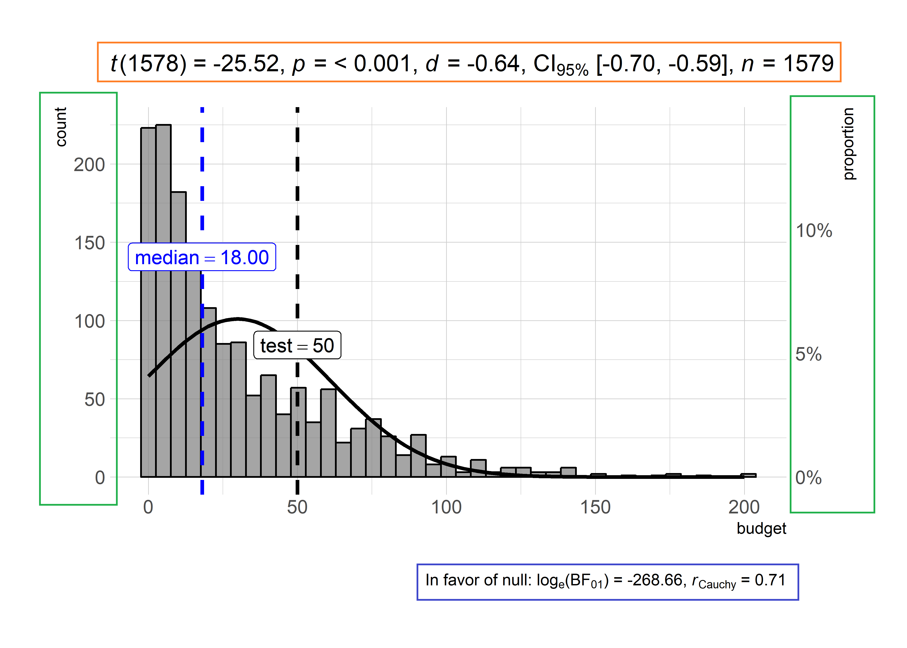
]

---

layout: false

class: inverse, center, middle

# ggdotplotstats
Distribution of a numeric variable with labels

---

layout: true

# ggdotplotstats

---

.left-code[
```{r ggdotplotstats_1, eval = FALSE}
ggdotplotstats(
  data = movies_long,
  x = budget,
  y = genre,
  test.value = 52, #<<     
  centrality.para = "median", 
  test.value.line = TRUE, #<<
  test.value.color = "red", #<<
  bf.message = TRUE, #<<
  ggtheme = ggthemes::theme_par(),
  messages = FALSE
) 
```

.font80[
Changing the type of test

- `"p"` → **parametric**

- `"np"` → **non-parametric**

- `"r"` → **robust**

- `"bf"` → **bayes factor**
]
]

.right-plot[
```{r ggdotplotstats_1, ref.label = 'ggdotplotstats_1', echo = FALSE}
```
]

---

.left-code[
```{r ggdotplotstats_1_copy, eval = FALSE}
ggdotplotstats(
  data = movies_long,
  x = budget,
  y = genre,
  test.value = 52,     
  centrality.para = "median", 
  test.value.line = TRUE, 
  test.value.color = "red",
  bf.message = TRUE
) 
```

.font80[
Default information:

- <font color="orange">statistical details</font>

- <font color="blue">Bayes Factor</font>

- <font color="green">distribution summary</font>
]
]

.right-plot[
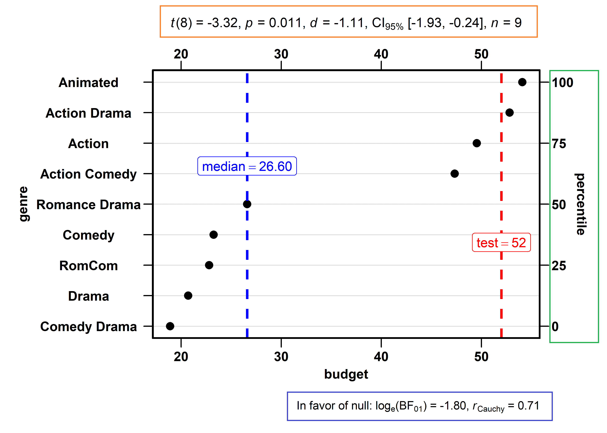
]

---

layout: false

class: inverse, center, middle

# ggpiestats
For composition of categorical variables

---

layout: true

# ggpiestats

---

.left-code[
```{r ggpiestats_1, eval = FALSE}
# let's use subset of data
ggpiestats(
  data = dplyr::filter(movies_long, 
  genre %in% c("Drama", "Comedy", "Animated")), 
  main = genre,
  condition = mpaa,
  paired = FALSE, # default #<< 
  conf.level = 0.99, #<<
  bf.message = TRUE, #<<
  package = "ggsci",
  palette = "default_ucscgb",
  messages = FALSE
)
```

.font80[

Test by design

- `paired = FALSE` → Pearson's $\chi^2$

- `paired = TRUE` → McNemar

]
]

.right-plot[
```{r ggpiestats_1, ref.label = 'ggpiestats_1', echo = FALSE}
```
]

---

layout: true

# ggpiestats - little code, loads information

---

.left-code[
```{r ggpiestats_1_copy, eval = FALSE}
# let's use subset of data
ggpiestats(
  data = dplyr::filter(movies_long, 
  genre %in% c("Drama", "Comedy", "Animated")), 
  main = genre,
  condition = mpaa,
  conf.level = 0.99, #<<
  bf.message = TRUE #<<
)
```

.font80[
Default information:

- <font color="orange">statistical details</font>

- <font color="blue">Bayes Factor</font>

- <font color="green">sample sizes</font>

- <font color="red">proportion test results</font>
]
]

.right-plot[
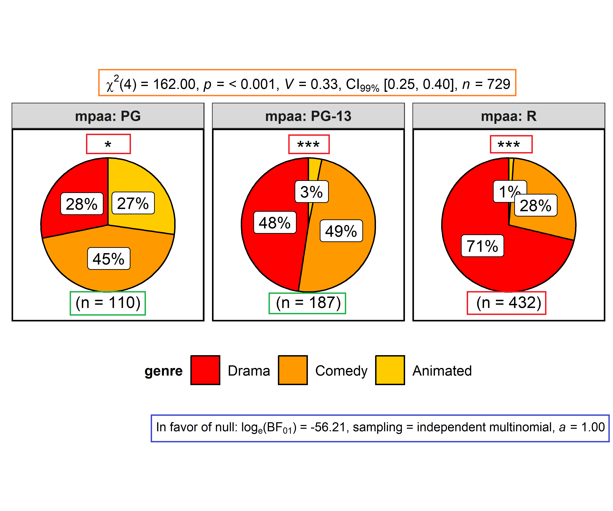
]

---

layout: true

# ggpiestats - proportion test

---

.left-code[
```{r ggpiestats_2, eval = FALSE}
ggpiestats(
  data = as.data.frame(Titanic), 
  main = Survived, #<<
  counts = Freq, #<<
  slice.label = "both", #<<
  messages = FALSE
)
```

.font70[
**Note** If the data is in *tabled* 
format, you can use the `counts` 
argument.

Test by analysis

- `condition != NULL` → contingency table

- `condition == NULL` → goodness of fit

]
]

.right-plot[
```{r ggpiestats_2, ref.label = 'ggpiestats_2', echo = FALSE}
```
]

---

layout: false

class: inverse, center, middle

# ggbarstats
For composition of categorical variables

---

layout: true

# ggbarstats - defaults

---

.left-code[
```{r ggbarstats_1, eval = FALSE}
ggbarstats(
  data = movies_long, 
  main = genre,
  condition = mpaa,
  paired = FALSE, # default #<<
  bf.message = TRUE, #<<
  package = "ggsci",
  palette = "default_igv",
  caption = substitute(                       #<< 
    paste(italic("Source"), ": www.imdb.com") #<<
  ),                                          #<<
  messages = FALSE
)
```

.font80[
<br>
**Note**: Even if you display 
Bayes Factor message in a caption, 
you can still use the `caption`
argument in all plotting functions.
]
]

.right-plot[
```{r ggbarstats_1, ref.label = 'ggbarstats_1', echo = FALSE}
```
]

---

layout: true

# ggbarstats - little code, loads information

---

.left-code[
```{r ggbarstats_1_copy, eval = FALSE}
ggbarstats(
  data = movies_long, 
  main = genre,
  condition = mpaa,
  bf.message = TRUE
)
```

.font80[
Default information:

- <font color="orange">statistical details</font>

- <font color="blue">Bayes Factor</font>

- <font color="green">sample sizes</font>

- <font color="red">proportion test results</font>
]
]

.right-plot[
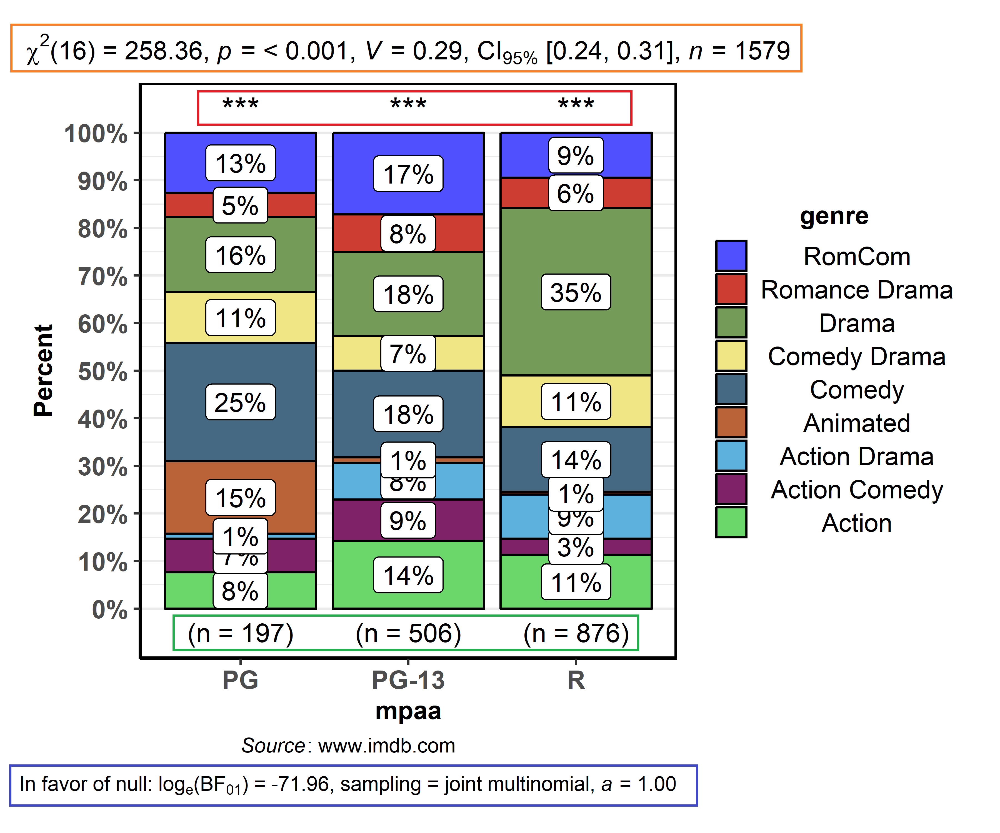
]

---

layout: false

class: inverse, center, middle

# ggcoefstats
Displaying results from regression analyses

---

layout: true

# ggcoefstats - defaults

---

.left-code[
```{r ggcoefstats_1, eval = FALSE}
# model
mod <- stats::aov(
  formula = rating ~ mpaa * genre,
  data = movies_long
)

# plot
ggcoefstats(x = mod)
```

.font80[
In addition to `"plot"` as `output`, 
this function can also be used to
get a <font color="blue">dataframe</font> of results:

- `"tidy"` → **estimates**

- `"glance"` → **model summary**

- `"augment"` → **predictions**
]
]

.right-plot[
```{r ggcoefstats_1, ref.label = 'ggcoefstats_1', echo = FALSE}
```
]

---

layout: true

# ggcoefstats - little code, loads information

---

.left-code[
```{r ggcoefstats_1_copy, eval = FALSE}
# model
mod <- stats::aov(
  formula = rating ~ mpaa * genre,
  data = movies_long
)

# plot
ggcoefstats(x = mod)
```

.font80[
Default information:

- <font color="red">estimate + 95% CI</font>

- <font color="blue">model summary</font>

- <font color="green">statistical details</font>
]
]

.right-plot[
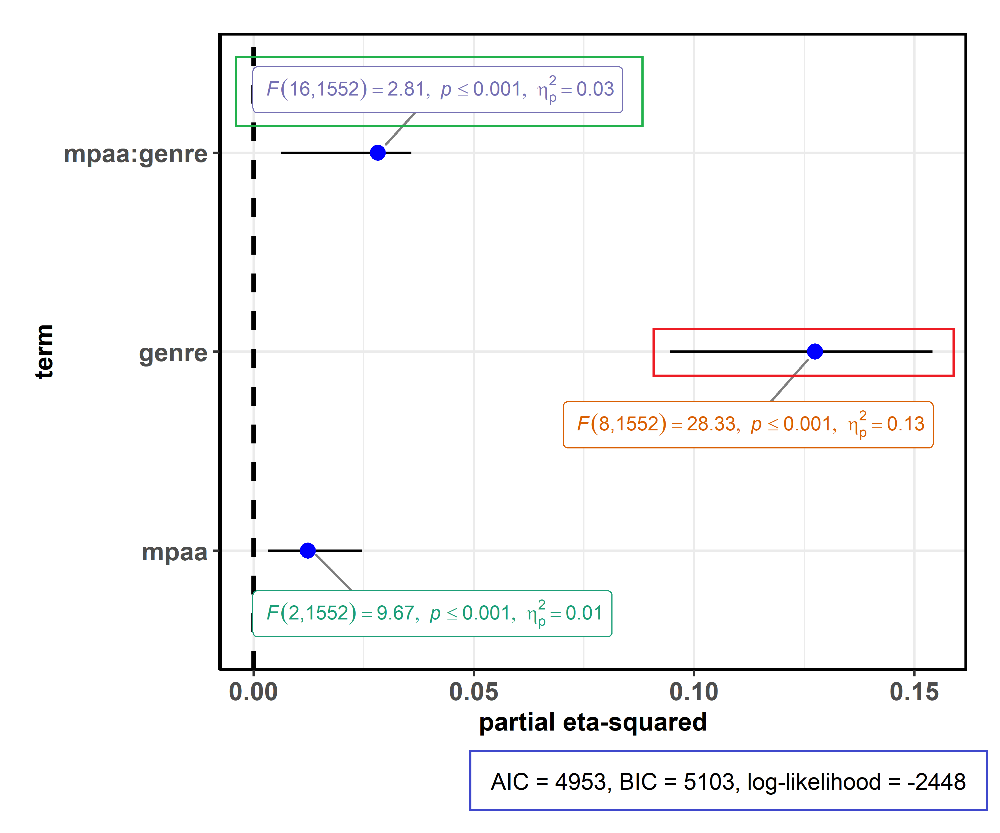
]

---

layout: true

# ggcoefstats - other outputs than plot

---

.pull-left[
.font70[
model summary

```{r ggcoefstats_5}
library(lme4)

# model
mod1 <- lme4::lmer(
  formula = Reaction ~ Days + (Days | Subject), 
  sleepstudy)

# dataframe
ggcoefstats(x = mod1, output = "glance")
```
]
]

.pull-right[
.font70[
augmented dataframe
```{r ggcoefstats_6}
library(ordinal)

# model
mod2 <- clm(formula = rating ~ temp * contact, 
            data = wine)

# dataframe
ggcoefstats(x = mod2, output = "augment") %>%
  head(5)
```
]
]

---

layout: true

# *ggcoefstats*: Supported models

---

.pull-left[
.pull-left[
- `aareg`
- `anova`
- `aov`
- `aovlist`
- `Arima` 
- `biglm`
- `brmsfit`
- `btergm`
- `cch`
- `clm`
- `clmm`
- `confusionMatrix`
- `coxph`
- `ergm`
]
.pull-right[
- `felm`
- `fitdistr`
- `glmerMod`
- `glmmTMB`
- `gls`
- `gam`
- `Gam`
- `gamlss`
- `garch`
- `glm` 
- `glmmadmb` 
- `glmmTMB`
- `glmrob`
- `gmm`
]
]

.pull-right[
.pull-left[
- `ivreg`
- `lm`
- `lm.beta`
- `lmerMod`
- `lmodel2`
- `lmrob`
- `mcmc`
- `MCMCglmm`
- `mediate` 
- `mjoint`
- `mle2`
- `multinom`
- `nlmerMod`
- `nlrq`
]
.pull-right[
- `nls`
- `orcutt`
- `plm`
- `polr`
- `ridgelm`
- `rlm`
- `rlmerMod`
- `rq`
- `speedlm`
- `stanreg`
- `survreg`
- `svyglm`
- `svyolr`
- `svyglm`
]
]

---

layout: true

# *ggcoefstats*: If not implemented, use a dataframe

---

.left-code[
```{r ggcoefstats_2, results = "hide", fig.show = "hide"}
# dataframe with results
df <- tibble::tribble(
  ~term, ~estimate, ~std.error, ~statistic, ~p.value,
  "(Intercept)", 3.77, 0.165, 22.9, 1.49e-20,
  "x", -1.36, 0.258, -5.26, 1.13e-5
)

# plot
ggcoefstats(
  x = df,
  statistic = "z",
  exclude.intercept = FALSE
)
```

.font70[
Supported statistic (for <font color="blue">dataframe</font> objects):
- *t*
- *z*
- *F*

At the minimum, two
columns needed - <br><font color="blue">term</font> and <font color="blue">estimate</font>.
]

]

.right-plot[
`)
]

---

layout: true

# *ggcoefstats*: You can also do meta-analysis!

---

.left-code[
```{r ggcoefstats_3, results = "hide", fig.show = "hide"}
# made up data
meta_df <- tibble::tribble(
  ~term, ~estimate, ~std.error,
  "study_1", 0.111, 0.065,
  "study_2", -0.003, 0.258,
  "study_3", 0.001, 0.120,
  "study_4", 0.032, 0.022,
  "study_5", -0.765, 0.650,
  "study_6", -0.032, 0.058
)

# plot
ggcoefstats(
  x = meta_df,
  meta.analytic.effect = TRUE, #<<
  xlab = "estimate"
)
```

.font100[
`r emo::ji("warning")` Work in progrss `r emo::ji("warning")`
]
]

.right-plot[
`)
]

---

layout: false

class: inverse, center, middle

# *grouped_* variants of all functions
Running the same function for 
all levels of a single grouping variable

---

layout: true

# grouped_ functions

You can repeat the same analysis for all levels of a single grouping variable.
---

.left-code[
```{r grouped_1, eval = FALSE}
# only one additional argument
grouped_ggpiestats(
  data = mtcars, 
  main = cyl,
  grouping.var = am, #<< 
  messages = FALSE
)
```

.font70[
Available `grouped_` variants

- `grouped_ggdotplotstats`
- `grouped_ggbarstats`    
- `grouped_ggscatterstats`
- `grouped_gghistostats`  
- `grouped_ggpiestats`    
- `grouped_ggbetweenstats`
- `grouped_ggcorrmat`  
]
]

.right-plot[
```{r grouped_1, ref.label = 'grouped_1', echo = FALSE}
```
]

---

layout: false

class: inverse, center, middle

# Utility beyond *ggstatsplot*
What if I don't like the default plots 
but still want to display statistical results?

---

layout: true

# Using subtitle helper functions

---

`ggstatsplot` can also be used just to get the statistical details.

--

.left-code[
```{r subtitle_1, eval = FALSE}
# using `ggstatsplot` for stats
results <- subtitle_contingency_tab(
  data = Titanic_full,
  main = Survived,
  condition = Sex,
  messages = FALSE
)

# using `ggiraphExtra` for plot
ggiraphExtra::ggSpine(
  data = Titanic_full,
  aes(x = Sex, fill = Survived),
  addlabel = TRUE,
  interactive = FALSE
) + labs(subtitle = results) # <<
```

.font80[
<br>
**All** included analyses have their
corresponding [helper functions](https://indrajeetpatil.github.io/ggstatsplot/reference/index.html#section-helper-functions-for-preparing-statistics-subtitles) for preparing 
subtitles with statistical details.
]
]

.right-plot[
```{r subtitle_1, ref.label = 'subtitle_1', echo = FALSE}
```
]

---

layout: false

class: inverse, center, middle

# Glossary
Statistical analyses in *ggstatsplot*

---

layout: false

# Best practices in reporting statistical details

--

- As discussed before, the details included in statistical analyses follow the
APA gold standard.

- The default tests follow the best practices. For example, `ggbetweenstats`
function by default runs <font color="blue">Welch's *t*-test</font> and <font
color="blue">Welch's ANOVA</font> - and not Student's *t*-test and Fisher's
ANOVA - based on recent work (Delacre et al.,
[2017](https://www.rips-irsp.com/article/10.5334/irsp.82/),
[2018](https://psyarxiv.com/wnezg)).

- No *p*-value error <br>
(Lilienfeld et al.,
[2015](https://www.frontiersin.org/articles/10.3389/fpsyg.2015.01100/full))

.img-center-small[
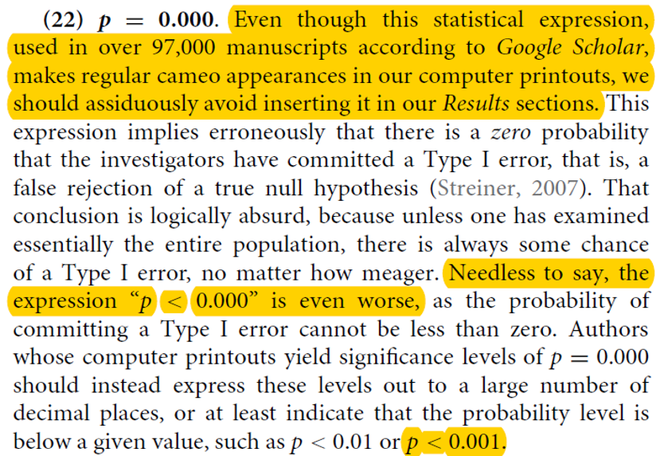
]

---

layout: false

# Avoiding errors

--

Since the plot and the statistical analysis are yoked together, the chances of
making an error in reporting the results are minimized. You never have to write
the results manually or copy-paste them from someplace else.


.footnote[(Nuijten et al., *Behavior Research Methods*, 2016)]

---

layout: false

# Making sense of null results

--

Combination of frequentist and Bayesian statistics for each analysis to properly
interpret the null results.


.footnote[(Aczel et al., *AMPPS*, 2018)]

---

layout: false

class: inverse, center, middle

# Glossary
Summary of statistical tests included
(as of 0.0.8.9000)

---

layout: false

# Types of statistical analyses supported

<br>

--

Functions | Description | Parametric | Non-parametric | Robust | Bayes Factor
------- | ------------------ | ---- | ----- | ----| ----- 
`ggbetweenstats` | Between group/condition comparisons | <font color="green">Yes</font> | <font color="green">Yes</font> | <font color="green">Yes</font> | <font color="green">Yes</font>
`gghistostats`, `ggdotplotstats` | Distribution of a numeric variable | <font color="green">Yes</font> | <font color="green">Yes</font> | <font color="green">Yes</font> | <font color="green">Yes</font>
`ggcorrmat` | Correlation matrix | <font color="green">Yes</font> | <font color="green">Yes</font> | <font color="green">Yes</font> | <font color="red">No</font>
`ggscatterstats` | Correlation between two variables | <font color="green">Yes</font> | <font color="green">Yes</font> | <font color="green">Yes</font> | <font color="green">Yes</font>
`ggpiestats`, `ggbarstats` | Association between categorical variables | <font color="green">Yes</font> | <font color="red">No</font> | <font color="red">No</font> | <font color="green">Yes</font>
`ggcoefstats` | Regression model coefficients | <font color="green">Yes</font> | <font color="red">No</font>| <font color="green">Yes</font> | <font color="red">No</font>

---

layout: false

# Effect sizes + CI available?

<br>

--

Test | Parametric | Non-parametric | Robust | Bayes
---------------------------- | ------ | ------ | ------ | ------
one-sample *t*-test | <font color="green">Yes</font> | <font color="green">Yes</font> | <font color="green">Yes</font> | <font color="red">No</font>
two-sample *t*-test (between) | <font color="green">Yes</font> | <font color="green">Yes</font> | <font color="green">Yes</font> | <font color="red">No</font>
two-sample *t*-test (within) | <font color="green">Yes</font> | <font color="green">Yes</font> | <font color="green">Yes</font> | <font color="red">No</font>
One-way ANOVA (between) | <font color="green">Yes</font> | <font color="green">Yes</font> | <font color="green">Yes</font> | <font color="red">No</font>
One-way ANOVA (within) | <font color="green">Yes</font> | <font color="red">No</font> | <font color="red">No</font> | <font color="red">No</font>
correlations | <font color="green">Yes</font> | <font color="green">Yes</font> | <font color="green">Yes</font> | <font color="red">No</font>
contingency table | <font color="green">Yes</font> | `NA` | `NA` | <font color="red">No</font>
goodness of fit | <font color="green">Yes</font> | `NA` | `NA` | <font color="red">No</font>
regression | <font color="green">Yes</font> | <font color="green">Yes</font> | <font color="green">Yes</font> | <font color="red">No</font>

---

layout: false

# Pairwise comparison tests in *ggbetweenstats*

<br>

--

Type | Design | Equal variance? |  Test | *p*-value adjustment? 
----------- | --------- | --- | ------------------------- | --
Parametric | between | No | Games-Howell test | <font color="green">Yes</font>  
Parametric | between | Yes | Student's *t*-test | <font color="green">Yes</font>  
Parametric | within | `NA` | Student's *t*-test | <font color="green">Yes</font>  
Non-parametric | between | No | Dwass-Steel-Crichtlow-Fligner test | <font color="green">Yes</font>  
Non-parametric | within | No | Durbin-Conover test | <font color="green">Yes</font>  
Robust | between | No | Yuen's trimmed means test | <font color="green">Yes</font>  
Robust | within |`NA` | Yuen's trimmed means test | <font color="green">Yes</font>  
Bayes Factor | between | No | <font color="red">No</font> | <font color="red">No</font>
Bayes Factor | between | Yes | <font color="red">No</font> | <font color="red">No</font>
Bayes Factor | within | `NA` | <font color="red">No</font> | <font color="red">No</font>

---

layout: false

class: inverse, center, middle

# Why use *ggstatsplot*? 
Summary of benefits

---

layout: true

# Benefits of using *ggstatsplot*

---

--

- Truly makes your figures worth a thousand words. 

--

- No need to copy-paste results to the text editor (MS-Word, e.g.).

--

- Disembodied figures stand on their own and are easy to evaluate for the reader.

--

- More breathing room for theoretical discussion and other text.

--

- No need to worry about updating figures and statistical details separately
  if something about the data changes.

--

- Minimal amount of code needed (minimizes chances of error).

---

layout: true

# Example

---

.pull-left[

**Without <font color="blue">ggstatsplot</font>**

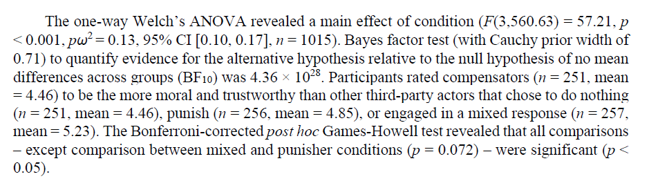
]

.pull-right[

**With <font color="blue">ggstatsplot</font>**


]

---

layout: true

# Quality assurance

---

--

`ggstatsplot` includes over <font color="blue">**1200**</font> tests to make
sure that all the functions are working properly. 

If you use `ggstatsplot` to report results in your publication and find an error
that traces back to code in this package, I will personally write an apology
letter to you and to the editor of the journal in question.


.footnote[*Reference*: <https://codecov.io/gh/IndrajeetPatil/ggstatsplot>]

---

layout: false

class: inverse, center, middle

# Limitations

---

layout: true

# Limitations

---

--

- Limited kinds of <font color="blue">plots</font> available.

--

- Limited number of statistical <font color="blue">tests</font> (and effect
sizes) available.

--

- <font color="blue">Faceting</font> (or small multiples) not implemented.

--

- Default plots can be too complicated for effectively communicating results in
time-constrained presentation settings (e.g., conference talks). 

--

- Bulky API (in terms of number of function arguments to keep in mind).

---

layout: true

# Overcoming these limitations

---

--

.pull-left[

.font80[
Contributions (big or small) welcome!
]


]

--

.pull-right[
.font80[
Ways in which you can contribute

- Read and correct any inconsistencies in the
[documentation](https://indrajeetpatil.github.io/ggstatsplot/)

- Raise issues about bugs or wanted features

- Review code

- Add new functionality (in the form of new plotting functions or helpers for
preparing subtitles)
]
]

---
layout: false

class: inverse, center, middle

# Not the only game in town
other options that pack informative graphics with statistical details

---

layout: true

# GUI softwares

---

--

.pull-left[

**jamovi**

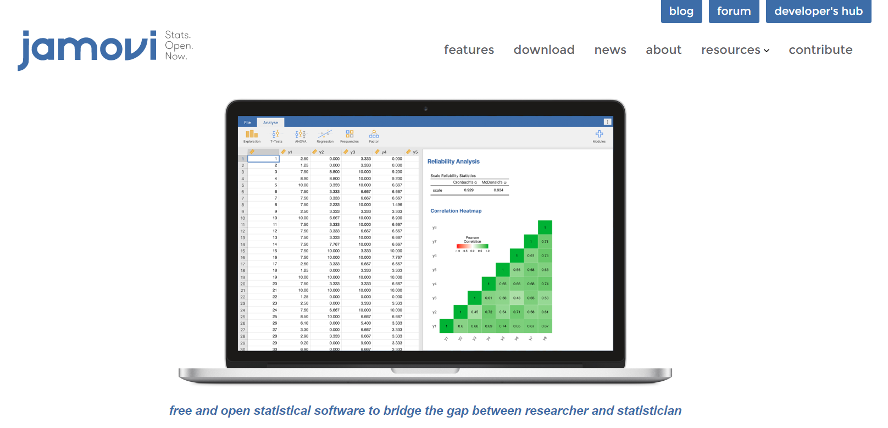
]

.pull-right[

**JASP**

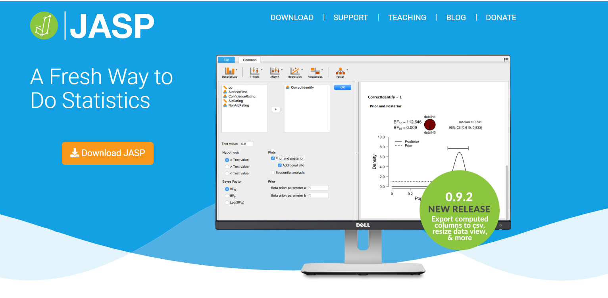
]

---


layout: false

class: center, middle

# Thanks!

**Acknowledgments**

Contributor to *ggstatsplot*: [Chuck Powell](https://github.com/ibecav)

Advisors: [Mina Cikara](http://www.intergroupneurosciencelaboratory.com/) and [Fiery Cushman](http://cushmanlab.fas.harvard.edu/index.php)

Slides created via the R package [**xaringan**](https://github.com/yihui/xaringan).

The CSS template comes from [Garrick Aden-Buie](https://github.com/gadenbuie/gentle-ggplot2).

---

layout: false

class: inverse, center, middle

# Thanks!

.font150.text-white[
[@patilindrajeets](https://twitter.com/patilindrajeets) <br>
[github.com/IndrajeetPatil](https://github.com/IndrajeetPatil) <br>
patilindrajeet.science@gmail.com
]
