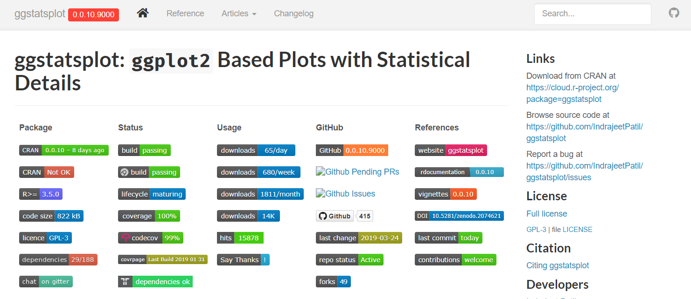

<style type="text/css">
body, td {
  font-size: 16px;
}
code.r{
  font-size: 14px;
}
</style>

```{r setup, include = FALSE}
knitr::opts_chunk$set(
  fig.width = 7,
  fig.height = 5,
  fig.retina = 2,
  fig.align = "center",
  out.width = "100%",
  dpi = 300,
  message = FALSE,
  warning = FALSE,
  cache = TRUE,
  autodep = TRUE,
  hiline = TRUE
)

knitr::opts_hooks$set(fig.callout = function(options) {
  if (options$fig.callout) {
    options$echo <- FALSE
    options$out.height <- "99%"
    options$fig.width <- 16
    options$fig.height <- 8
  }
  options
})

options(
  htmltools.dir.version = FALSE,
  width = 90,
  max.print = 9999,
  knitr.table.format = "html",
  crayon.enabled = TRUE
)

as_table <- function(...) knitr::kable(..., format = "html", digits = 3)
```

---

layout: true

# Plan

---

--

- Why `ggstatsplot`?

- Current functions

- Benefits and scalability

- Limitations

---

layout: false

class: inverse, center, middle

# Why *ggstatsplot*?

---

layout: true

# Raison d'être

---

--

.right-column[.font150[
Current count of packages on the Comprehensive R Archive Network (**CRAN**)
**<font color="red"> > 16,000</font>**
]
.footnote[<https://cran.r-project.org/web/packages/>]
]

--

.left-column[

]

--

.right-column[.font150[
Short answer: `ggstatsplot` provides a collection of <font color="blue">*information-rich*</font> plots with <font color="blue">*statistical details*</font> and is suitable for scholarly publications and quick (exploratory) statistical analysis.
]
]

---

layout: true

# Simpler data analysis workflow

---

--

.img-center[

]

.footnote[[(Grolemund & Wickham, *R for Data Science*, 2017)](https://r4ds.had.co.nz/)]

--

<br>
<br>
<br>
<br>
<br>
<br>
<br>
<br>
In a typical *exploratory* data analysis workflow, <font color="blue">data visualization</font> and <font color="blue">statistical modeling</font> are two different phases: visualization informs modeling,
and modeling can suggest a different visualization, and so on and so forth. 

--

The central idea of **ggstatsplot** is simple: combine these two phases into one
in the form of graphics with statistical detail for <font color="blue">simpler</font> and <font color="blue">faster</font> data exploration.

---

layout: true

# Information-rich graphic is worth a thousand words

---

--

.img-center[

]


.footnote[[(Matejka & Fitzmaurice, *Autodesk Research*, 2017)](https://www.autodeskresearch.com/publications/samestats)]

--

<br>
<br>
<br>
<br>
<br>
<br>
<br>
<br>
<br>
<br>
<br>
.font150[“I plotted my data and what I found surprised me!" - BuzzFeed]

---

layout: false

# Ready-made plot = no customization

--

The **grammar of graphics** (implemented in `ggplot2`) is an incredibly powerful
framework [(Wilkinson, 2011)](https://www.google.com/books/edition/_/iI1kcgAACAAJ?hl=en&sa=X&ved=2ahUKEwiGl8rJ2KztAhWyElkFHa8NAvkQre8FMBR6BAgMEAc) to prepare graphics and can help you make
infinite number of graphics, each tailored for your specific data visualization
problem! But...

--

.pull-left[

]

.pull-right[

]

---

layout: false

# Consistent API =  no cognitive fatigue

--

```{r lm, eval = FALSE}
stats::lm(formula = wt ~ mpg, data = mtcars)
```

--

```{r cor, eval = FALSE}
stats::cor(x = mtcars$wt, y = mtcars$mpg)
```

--

```{r cor.test, eval = FALSE}
stats::cor.test(formula = ~ wt + mpg, data = mtcars)
```

--

.img-right-small[

]

--

<br>
<br>
**All** functions in `ggstatsplot`-

`r emo::ji("check")` rely on a **dataframe** (e.g., `data, x, y, ...`)<br>
`r emo::ji("check")` expect **tidy** data (Wickham, [2014](https://vita.had.co.nz/papers/tidy-data.pdf))<br>
`r emo::ji("check")` accept both `"string"` and `symbols` as arguments<br>

---

layout: false

class: inverse, center, middle

# Get Started

---

layout: false

# Installation

--

Install the **ggstatsplot** package from 
[CRAN](https://cran.r-project.org/web/packages/ggstatsplot/index.html):

```{r utils, eval = FALSE, tidy = FALSE}
install.packages("ggstatsplot")
```
--

You can get the development version of the package from
[Github](https://github.com/IndrajeetPatil/ggstatsplot):

```{r github, eval = FALSE, tidy = FALSE}
library(remotes)
remotes::install_github("IndrajeetPatil/ggstatsplot")
```

--

Load the needed packages-

```{r load, eval = TRUE, warning=FALSE}
library(ggstatsplot)
library(ggplot2)
```

---

layout: false

class: inverse, center, middle

# ggbetweenstats
For between group/condition comparisons

---

layout: true

# ggbetweenstats - defaults

---

.left-code[
```{r ggbetweenstats_1, eval = FALSE}
ggbetweenstats(
  data = movies_long,
  x = mpaa,
  y = rating
)
```

.font70[
Function internally decides tests

- *t*-test if **2** groups
- ANOVA if **> 2** groups

Defaults return<br>

`r emo::ji("check")` raw data<br>
`r emo::ji("check")` descriptive statistics<br>
`r emo::ji("check")` statistic + *p*-value<br>
`r emo::ji("check")` effect size + CIs<br>
`r emo::ji("check")` pairwise comparisons<br>
`r emo::ji("check")` Bayesian hypothesis-testing<br>
`r emo::ji("check")` Bayesian estimation<br>
]

]

.right-plot[
```{r ggbetweenstats_1, ref.label = 'ggbetweenstats_1', echo = FALSE}
```
]

---

layout: true

# ggbetweenstats - pairwise comparisons

---

.left-code[
```{r ggbetweenstats_2, eval = FALSE}
ggbetweenstats(
  data = movies_long,
  x = mpaa,
  y = rating,
  type = "np", #<<
  pairwise.display = "ns", #<<
  p.adjust.method = "fdr" #<<
)
```

.font70[
Changing the `type` of test

`r emo::ji("check")` `"p"` → **parametric** (default)<br>
`r emo::ji("check")` `"np"` → **non-parametric**<br>
`r emo::ji("check")` `"r"` → **robust** <br>
`r emo::ji("check")` `"bf"` → **Bayes Factor**

Changing pairwise comparisons displayed

- `"ns"` → only **non-significant**
- `"s"` → only **significant**
- `"all"` → **all**
]
]

.right-plot[
```{r ggbetweenstats_2, ref.label = 'ggbetweenstats_2', echo = FALSE}
```
]

---

layout: true

# ggbetweenstats - outlier tagging

---

.left-code[
```{r ggbetweenstats_3, eval = FALSE}
ggbetweenstats(
  data = movies_long,
  x = mpaa,
  y = rating,
  type = "r", #<<
  outlier.tagging = TRUE, #<<
  outlier.label = title, #<<
  outlier.coef = 2 #<<
)
```
]

.right-plot[
```{r ggbetweenstats_3, ref.label = 'ggbetweenstats_3', echo = FALSE}
```
]

---

layout: false

class: inverse, center, middle

# ggwithinstats
For within group/condition comparisons<br>

---

layout: true

# ggwithinstats - repeated measures equivalent

---

.left-code[
```{r ggwithinstats_1, eval = FALSE}
ggwithinstats(
  data = WRS2::WineTasting,
  x = Wine,
  y = Taste
)
```

.font70[
Defaults return<br>

`r emo::ji("check")` raw data<br>
`r emo::ji("check")` descriptive statistics<br>
`r emo::ji("check")` statistic + *p*-value<br>
`r emo::ji("check")` effect size + CIs<br>
`r emo::ji("check")` pairwise comparisons<br>
`r emo::ji("check")` Bayesian hypothesis-testing<br>
`r emo::ji("check")` Bayesian estimation<br>

Changing the `type` of test

`r emo::ji("check")` `"p"` → **parametric** (default)<br>
`r emo::ji("check")` `"np"` → **non-parametric**<br>
`r emo::ji("check")` `"r"` → **robust** <br>
`r emo::ji("check")` `"bf"` → **Bayes Factor**
]
]

.right-plot[
```{r ggwithinstats_1, ref.label = 'ggwithinstats_1', echo = FALSE}
```
]

---

layout: false

class: inverse, center, middle

# ggscatterstats
Association between two numeric variables

---

layout: true

# ggscatterstats - defaults

---

.left-code[
```{r ggscatterstats_1, eval = FALSE}
ggscatterstats(
  data = movies_long,
  x = budget,
  y = rating
)
```

.font70[
Defaults return<br>

`r emo::ji("check")` raw data<br>
`r emo::ji("check")` marginal distributions<br>
`r emo::ji("check")` statistic + *p*-value<br>
`r emo::ji("check")` effect size + CIs<br>
`r emo::ji("check")` Bayesian hypothesis-testing<br>
`r emo::ji("check")` Bayesian estimation<br>

Changing the `type` of test

`r emo::ji("check")` `"p"` → **parametric** (default)<br>
`r emo::ji("check")` `"np"` → **non-parametric**<br>
`r emo::ji("check")` `"r"` → **robust** <br>
`r emo::ji("check")` `"bf"` → **Bayes Factor**
]
]

.right-plot[
```{r ggscatterstats_1, ref.label = 'ggscatterstats_1', echo = FALSE}
```
]

---

layout: true

# ggscatterstats - conditional point tagging

---

.left-code[
```{r ggscatterstats_2, eval = FALSE}
ggscatterstats(
  data = movies_long,
  x = budget,
  y = rating,
  type = "r",
  label.var = title, #<<
  label.expression = budget > 150 #<<
  & rating > 7.5, #<<
  marginal.type = "density" #<<
)
```

.font70[
Changing the marginal type

- **histogram**
- **boxplot**
- **density**
- **violin**
- **densigram**
]
]

.right-plot[
```{r ggscatterstats_2, ref.label = 'ggscatterstats_2', echo = FALSE}
```
]

---

layout: false

class: inverse, center, middle

# ggcorrmat
Association between multiple numeric variables

---

layout: true

# ggcorrmat - defaults

---

.left-code[
```{r ggcorrmat_1, eval = FALSE}
ggcorrmat(dplyr::starwars)
```

.font70[
Defaults return<br>

`r emo::ji("check")` effect size + significance<br>
`r emo::ji("check")` careful handling of `NA`s

Changing the `type` of test

`r emo::ji("check")` `"p"` → **parametric** (default)<br>
`r emo::ji("check")` `"np"` → **non-parametric**<br>
`r emo::ji("check")` `"r"` → **robust** <br>
`r emo::ji("x")` `"bf"` → **Bayes Factor**

]
]

.right-plot[
```{r ggcorrmat_1, ref.label = 'ggcorrmat_1', echo = FALSE}
```
]

---

layout: true

# ggcorrmat - changing defaults

---

.left-code[

.font70[
In addition to `output = "plot"`, 
this function can also be used to
get a <font color="blue">dataframe</font> of results:
]

```{r ggcorrmat_2, eval = FALSE}
ggcorrmat(
  data = ggplot2::msleep,
  cor.vars = sleep_cycle:bodywt,
  type = "bf",
  output = "dataframe"
)
```

]

.font50[
.right-plot[
```{r ggcorrmat_2, ref.label = 'ggcorrmat_2', echo = FALSE}
```
]
]

---

layout: false

class: inverse, center, middle

# gghistostats
Distribution of a numeric variable

---

layout: true

# gghistostats - defaults

---

.left-code[
```{r gghistostats_1, eval = FALSE}
gghistostats(
  data = movies_long,
  x = budget,
  test.value = 30 #<<
)
```

.font70[
Defaults return<br>

`r emo::ji("check")` counts + proportion for bins<br>
`r emo::ji("check")` descriptive statistics<br>
`r emo::ji("check")` statistic + *p*-value<br>
`r emo::ji("check")` effect size + CIs<br>
`r emo::ji("check")` Bayesian hypothesis-testing<br>
`r emo::ji("check")` Bayesian estimation<br>

Changing the `type` of test

`r emo::ji("check")` `"p"` → **parametric** (default)<br>
`r emo::ji("check")` `"np"` → **non-parametric**<br>
`r emo::ji("check")` `"r"` → **robust** <br>
`r emo::ji("check")` `"bf"` → **Bayes Factor**
]
]

.right-plot[
```{r gghistostats_1, ref.label = 'gghistostats_1', echo = FALSE}
```
]

---

layout: false

class: inverse, center, middle

# ggdotplotstats
Distribution of a numeric variable with labels

---

layout: true

# ggdotplotstats - defaults

---

.left-code[
```{r ggdotplotstats_1, eval = FALSE}
ggdotplotstats(
  data = movies_long,
  x = budget,
  y = genre,
  test.value = 52, #<<
  test.value.line = TRUE #<<
)
```

.font70[
Defaults return<br>

`r emo::ji("check")` descriptive statistics<br>
`r emo::ji("check")` statistic + *p*-value<br>
`r emo::ji("check")` effect size + CIs<br>
`r emo::ji("check")` Bayesian hypothesis-testing<br>
`r emo::ji("check")` Bayesian estimation<br>

Changing the `type` of test

`r emo::ji("check")` `"p"` → **parametric** (default)<br>
`r emo::ji("check")` `"np"` → **non-parametric**<br>
`r emo::ji("check")` `"r"` → **robust** <br>
`r emo::ji("check")` `"bf"` → **Bayes Factor**
]
]

.right-plot[
```{r ggdotplotstats_1, ref.label = 'ggdotplotstats_1', echo = FALSE}
```
]

---

layout: false

class: inverse, center, middle

# ggpiestats
For composition of categorical variables

---

layout: true

# ggpiestats - contingency table

---

.left-code[
```{r ggpiestats_1, eval = FALSE}
# let's use subset of data
ggpiestats(
  data = dplyr::filter(
    .data = movies_long,
    genre %in% c("Drama", "Comedy")
  ),
  x = mpaa,
  y = genre
)
```

.font70[
Defaults return<br>

`r emo::ji("check")` descriptive statistics<br>
`r emo::ji("check")` statistic + *p*-value<br>
`r emo::ji("check")` effect size + CIs<br>
`r emo::ji("check")` Goodness-of-fit tests<br>
`r emo::ji("check")` Bayesian hypothesis-testing<br>
`r emo::ji("check")` Bayesian estimation<br>

Test by design

- `paired = FALSE` → Pearson's $\chi^2$
- `paired = TRUE` → McNemar

]
]

.right-plot[
```{r ggpiestats_1, ref.label = 'ggpiestats_1', echo = FALSE}
```
]

---

layout: true

# ggpiestats - proportion test

---

.left-code[
```{r ggpiestats_2, eval = FALSE}
ggpiestats(
  data = as.data.frame(Titanic),
  x = Survived, 
  counts = Freq, #<<
  label = "both" #<<
)
```

.font70[
**Note**: If the data is in *tabled* 
format, you can use the `counts` 
argument.

Test by analysis

- `y != NULL` → contingency table
- `y == NULL` → goodness of fit

]
]

.right-plot[
```{r ggpiestats_2, ref.label = 'ggpiestats_2', echo = FALSE}
```
]

---

layout: false

class: inverse, center, middle

# ggbarstats
For composition of categorical variables

---

layout: true

# ggbarstats - defaults

---

.left-code[
```{r ggbarstats_1, eval = FALSE}
ggbarstats(
  data = movies_long,
  x = genre,
  y = mpaa,
  package = "ggsci",
  palette = "default_igv"
)
```

.font70[
Defaults return<br>

`r emo::ji("check")` descriptive statistics<br>
`r emo::ji("check")` statistic + *p*-value<br>
`r emo::ji("check")` effect size + CIs<br>
`r emo::ji("check")` Goodness-of-fit tests<br>
`r emo::ji("check")` Bayesian hypothesis-testing<br>
`r emo::ji("check")` Bayesian estimation<br>
]
]

.right-plot[
```{r ggbarstats_1, ref.label = 'ggbarstats_1', echo = FALSE}
```
]

---

layout: false

class: inverse, center, middle

# ggcoefstats
Displaying results from regression analyses

---

layout: true

# ggcoefstats - defaults

---

.left-code[
```{r ggcoefstats_1, eval = FALSE}
# model
mod <- stats::aov(
  formula = rating ~ mpaa * genre,
  data = movies_long
)

# plot
ggcoefstats(mod)
```

.font70[
In addition to `output = "plot"`, 
this function can also be used to
get a <font color="blue">dataframe</font> of results:

- `"tidy"` → **estimates**
- `"glance"` → **model summary**

Defaults return<br>

`r emo::ji("check")` statistic + *p*-value<br>
`r emo::ji("check")` estimate + CIs<br>
`r emo::ji("check")` model summary (AIC + BIC)
]

]

.right-plot[
```{r ggcoefstats_1, ref.label = 'ggcoefstats_1', echo = FALSE}
```
]

---

layout: true

# ggcoefstats: Supported models

---

.font70[
`aareg`, `anova`, `aov`, `aovlist`, `Arima`, `bam`, `bayesx`, `bayesGARCH`,
`BBmm`, `BBreg`, `bcplm`, `betamfx`, `betaor`, `BFBayesFactor`, `bglmerMod`,
`bife`, `bigglm`, `biglm`, `blavaan`, `bmlm`, `blmerMod`, `bracl`, `brglm`,
`brglm2`, `brmsfit`, `brmultinom`, `btergm`, `cch`, `censReg`, `cgam`, `cgamm`,
`cglm`, `clm`, `clm2`, `clmm`, `clmm2`, `coeftest`, `complmrob`,
`confusionMatrix`, `coxme`, `coxph`, `coxph.penal`, `cpglm`, `cpglmm`, `crch`,
`crq`, `DirichReg`, `drc`, `emmGrid`, `epi.2by2`, `ergm`, `feis`, `felm`,
`fitdistr`, `flexsurvreg`, `gam`, `Gam`, `gamlss`, `garch`, `geeglm`, `glmc`,
`glmerMod`, `glmmTMB`, `gls`, `glht`, `glm`, `glmm`, `glmmadmb`, `glmmPQL`,
`glmRob`, `glmrob`, `glmx`, `gmm`, `HLfit`, `hurdle`, `ivreg`, `iv_robust`,
`lavaan`, `lm`, `lm.beta`, `lmerMod`, `lmerModLmerTest`, `lmodel2`, `lmRob`,
`lmrob`, `lm_robust`, `logitmfx`, `logitor`, `logitsf`, `LORgee`, `lqm`, `lqmm`,
`lrm`, `manova`, `maov`, `margins`, `mcmc`, `mcmc.list`, `MCMCglmm`, `mclogit`,
`mice`, `mmclogit`, `mediate`, `metafor`, `merMod`, `merModList`, `metaplus`,
`mixor`, `mjoint`, `mle2`, `mlm`, `multinom`, `negbin`, `negbinmfx`,
`negbinirr`, `nlmerMod`, `nlrq`, `nlreg`, `nls`, `orcutt`, `orm`, `plm`,
`poissonmfx`, `poissonirr`, `polr`, `ridgelm`, `rjags`, `rlm`, `rlmerMod`,
`robmixglm`, `rq`, `rqss`, `rrvglm`, `scam`, `semLm`, `semLme`, `slm`,
`speedglm`, `speedlm`, `stanfit`, `stanreg`, `survreg`, `svyglm`, `svyolr`,
`svyglm`, `tobit`, `truncreg`, `vgam`, `vglm`, `wbgee`, `wblm`, `zeroinfl`, etc.
]

---

layout: true

# ggcoefstats: If not implemented, use a dataframe

---

.left-code[
```{r ggcoefstats_2, eval = FALSE}
library(parameters)

# dataframe with results
df <-
  model_parameters(stats::lm(wt ~ cyl, mtcars)) %>%
  standardize_names(., "broom")

# `statistic` argument decides label format
ggstatsplot::ggcoefstats(
  x = df,
  statistic = "t" #<<
)
```

.font70[
Supported statistic:
- *t*
- *z*
- *F*
- $\chi^2$

At the minimum, one
column needed - <font color="blue">estimate</font>.
]

]

.right-plot[
```{r ggcoefstats_2, ref.label = 'ggcoefstats_2', echo = FALSE}
```
]

---

layout: false

class: inverse, center, middle

# *grouped_* variants of all functions
Running the same function for 
all levels of a single grouping variable

---

layout: true

# *grouped_* functions

---

--

.left-code[
```{r grouped_1, eval = FALSE}
# only one additional argument
grouped_ggpiestats(
  data = mtcars,
  x = cyl,
  grouping.var = am, #<<
  results.subtitle = FALSE #<<
)
```

.font70[
Available `grouped_` variants
- `grouped_ggdotplotstats`
- `grouped_ggbarstats`
- `grouped_ggscatterstats`
- `grouped_gghistostats`
- `grouped_ggpiestats`
- `grouped_ggbetweenstats`
- `grouped_ggwithinstats`
- `grouped_ggcorrmat`
]
]

.right-plot[
```{r grouped_1, ref.label = 'grouped_1', echo = FALSE}
```
]

---

layout: false

class: inverse, center, middle

# Customizability of *ggstatsplot*
What if I don't like the default plots

---

exclude: false

layout: true

# Defaults

---

exclude: false

.pull-left[
.font100[
The default plots in *<font color="blue">ggstatsplot</font>* are
**opinionated**, yes, but an attempt has been made to make sure that they
follow best principles outlined in the data visualization research.
]
]

.pull-right[

]

---

layout: true

# Changing aesthetics (themes + palettes)

---

.left-code[
```{r ggbetweenstats_4, eval = FALSE}
ggbetweenstats(
  data = movies_long,
  x = mpaa,
  y = rating,
  results.subtitle = FALSE,
  ggtheme = hrbrthemes::theme_ipsum_tw(), #<<
  palette = "Darjeeling2", #<<
  package = "wesanderson" #<<
)
```

.font70[
Aesthetic preferences
are not an excuse to not
use `ggstatsplot`! `r emo::ji("heart_eyes_cat")`

The default palette used
is **colorblind-friendly**.
]
]

.right-plot[
```{r ggbetweenstats_4, ref.label = 'ggbetweenstats_4', echo = FALSE}
```
]

---

layout: true

# Further modification with *ggplot2*

---

.left-code[
```{r ggbetweenstats_5, eval = FALSE}
ggbetweenstats(
  data = mtcars,
  x = am,
  y = wt,
  type = "bf"
) +
  scale_y_continuous(sec.axis = dup_axis()) #<<
```

.font70[
**Note**: You can modify 
all `ggstatsplot` plots further 
using `ggplot2` functions.
Yaay!
]

.img-left-small[

]

]

.right-plot[
```{r ggbetweenstats_5, ref.label = 'ggbetweenstats_5', echo = FALSE}
```
]

---

layout: true

# To extract expression

---

`ggstatsplot` can also be used just to get the statistical expressions.

--

.left-code[
```{r subtitle_1, eval = FALSE}
# using `ggstatsplot` for stats
results <-
  ggstatsplot::ggpiestats(
    data = Titanic_full,
    x = Survived,
    y = Sex,
    output = "subtitle" #<<
  )

# using `ggiraphExtra` for plot
ggiraphExtra::ggSpine( #<<
  data = Titanic_full,
  aes(x = Sex, fill = Survived),
  addlabel = TRUE,
  interactive = FALSE
) + labs(subtitle = results) #<<
```

.font70[
<br>
**All** included analyses have their
corresponding [helper functions](https://indrajeetpatil.github.io/statsExpressions/reference/index.html) for preparing subtitles with statistical details.
]
]

.right-plot[
```{r subtitle_1, ref.label = 'subtitle_1', echo = FALSE}
```
]

---

layout: false

class: inverse, center, middle

# Glossary
Statistical reporting in *ggstatsplot*

---

layout: false

# Types of statistical analyses supported

<br>

--

Functions | Description | Parametric | Non-parametric | Robust | Bayes Factor
------- | ------------------ | ---- | ----- | ----| ----- 
`ggbetweenstats` | Between group/condition comparisons | **<font color="green">Yes</font>** | **<font color="green">Yes</font>** | **<font color="green">Yes</font>** | **<font color="green">Yes</font>**
`ggwithinstats` | Within group/condition comparisons | **<font color="green">Yes</font>** | **<font color="green">Yes</font>** | **<font color="green">Yes</font>** | **<font color="green">Yes</font>**
`gghistostats`, `ggdotplotstats` | Distribution of a numeric variable | **<font color="green">Yes</font>** | **<font color="green">Yes</font>** | **<font color="green">Yes</font>** | **<font color="green">Yes</font>**
`ggcorrmat` | Correlation matrix | **<font color="green">Yes</font>** | **<font color="green">Yes</font>** | **<font color="green">Yes</font>** | **<font color="green">Yes</font>**
`ggscatterstats` | Correlation between two variables | **<font color="green">Yes</font>** | **<font color="green">Yes</font>** | **<font color="green">Yes</font>** | **<font color="green">Yes</font>**
`ggpiestats`, `ggbarstats` | Association between categorical variables | **<font color="green">Yes</font>** | `NA` | `NA` | **<font color="green">Yes</font>**
`ggpiestats`, `ggbarstats` | Equal proportions for categorical variable levels | **<font color="green">Yes</font>** | `NA` | `NA` | **<font color="green">Yes</font>**
`ggcoefstats` | Regression model coefficients | **<font color="green">Yes</font>** | **<font color="green">Yes</font>** | **<font color="green">Yes</font>** | **<font color="green">Yes</font>**
`ggcoefstats` | Random-effects meta-analysis | **<font color="green">Yes</font>** | `NA` | **<font color="green">Yes</font>** | **<font color="green">Yes</font>**

---

layout: false

# Best practices in reporting statistical details

--

- For all statistical tests reported in the plots, the default template mostly abides
by the [APA](https://my.ilstu.edu/~jhkahn/apastats.html) gold standard for
statistical reporting. For example, here are results from a robust *t*-test:


--

- The default tests follow the best practices. For example, `ggbetweenstats`
function by default runs <font color="blue">Welch's *t*-test</font> and <font
color="blue">Welch's ANOVA</font> - and not Student's *t*-test and Fisher's
ANOVA - based on recent work (Delacre et al.,
[2017](https://www.rips-irsp.com/article/10.5334/irsp.82/),
[2018](https://psyarxiv.com/wnezg)).

---

layout: false

# Avoiding errors

--

Since the plot and the statistical analysis are yoked together, the chances of
making an error in reporting the results are minimized. You never have to write
the results manually or copy-paste them from someplace else.


.footnote[[(Nuijten et al., *Behavior Research Methods*, 2016)](https://link.springer.com/article/10.3758/s13428-015-0664-2)]

---

layout: false

# Making sense of null results

--

Combination of frequentist and Bayesian statistics for each analysis to properly
interpret the null results.


.footnote[[(Aczel et al., *AMPPS*, 2018)](https://journals.sagepub.com/doi/pdf/10.1177/2515245918773742)]

---

layout: false

# Toggling between type of statistics

--

.pull-left[
**<font color="blue">Parametric<font>**
```{r type_p, eval = FALSE}
# anova
ggbetweenstats(
  data = mtcars,
  x = cyl,
  y = wt,
  type = "p" #<<
)

# correlation analysis
ggscatterstats(
  data = mtcars,
  x = wt,
  y = mpg,
  type = "p" #<<
)

# t-test
gghistostats(
  data = mtcars,
  x = wt,
  test.value = 2,
  type = "p" #<<
)
```
]

--

.pull-right[
**<font color="#ff6600">Non-parametric<font>** 
```{r type_np, eval = FALSE}
# anova
ggbetweenstats(
  data = mtcars,
  x = cyl,
  y = wt,
  type = "np" #<<
)

# correlation analysis
ggscatterstats(
  data = mtcars,
  x = wt,
  y = mpg,
  type = "np" #<<
)

# t-test
gghistostats(
  data = mtcars,
  x = wt,
  test.value = 2,
  type = "np" #<<
)
```
]

---

layout: false

class: inverse, center, middle

# Why use *ggstatsplot*? 
Summary of benefits

---

layout: true

# Benefits of using *ggstatsplot*

---

--

- No need to use scores of packages to get different statistical details
    (e.g., one to get stats, one to get effect sizes, another to get Bayes
    Factors, and yet another to get pairwise comparisons, etc.).

--

- Minimal amount of code needed for all functions (typically only `data`, `x`,
  and `y`). This minimizes chances of error.
  
--

- Truly makes your figures worth a thousand words. 

--

- No need to copy-paste results to the text editor (MS-Word, e.g.).

--

- Disembodied figures stand on their own and are easy to evaluate for the reader.

--

- More breathing room for theoretical discussion and other text.

--

- No need to worry about updating figures and statistical details separately
  if something about the data changes.

---

layout: true

# Documentation

---

Exhaustive documentation at the dedicated website- <br>
<https://indrajeetpatil.github.io/ggstatsplot/>



---

layout: false

class: inverse, center, middle

# Misconceptions

---

layout: true

# Misconceptions about scope of *ggstatsplot*

---

This package is... 

--

- an alternative to learning `ggplot2`. `r emo::ji("x")`

--

- meant to be used in talks/presentations. `r emo::ji("x")`

---

layout: false

class: inverse, center, middle

# Limitations

---

layout: true

# Limitations of *ggstatsplot*

---

--

- Limited kinds of <font color="blue">plots</font> available.

--

- Limited number of statistical <font color="blue">tests</font> (and effect
sizes) available.

--

- Requires non-trivial level of statistical proficiency (but only plots
  without stats can also be used).

--

- <font color="blue">Faceting</font> (or small multiples) not implemented.

--

- Default plots can be too complicated for effectively communicating results in
time-constrained presentation settings (e.g., conference talks). 

--

- <font color="blue">Bulky API</font> (in terms of number of function arguments to keep in mind).<br>
(Saving grace: Defaults are sufficient most of the time.)

---

layout: true

# Overcoming these limitations

---

--

.pull-left[

.font90[
Contributions (big or small) welcome!
]


]

--

.pull-right[
.font90[
Ways in which you can contribute

- Read and correct any inconsistencies in the
[documentation](https://indrajeetpatil.github.io/ggstatsplot/)

- Raise issues about bugs or wanted features

- Review code

- Add new functionality (in the form of new plotting functions or helpers for
preparing subtitles)
]
]

---

layout: false

class: inverse, center, middle

# Acknowledgments

Contributors to *ggstatsplot*

Advisors: [Mina Cikara](http://www.intergroupneurosciencelaboratory.com/), [Fiery Cushman](http://cushmanlab.fas.harvard.edu/index.php), [Iyad Rahwan](https://rahwan.me/)

Slides created via the R package [xaringan](https://github.com/yihui/xaringan).

The CSS template comes from [Garrick Aden-Buie](https://github.com/gadenbuie/gentle-ggplot2).

---

layout: false

class: inverse, center, middle

# Find me at...

.font150.text-white[

[`r icon::fa("twitter")` @patilindrajeets](http://twitter.com/patilindrajeets)  
[`r icon::fa("github")` @IndrajeetPatil](http://github.com/IndrajeetPatil)  
[`r icon::fa("link")` https://sites.google.com/site/indrajeetspatilmorality/](https://sites.google.com/site/indrajeetspatilmorality/)  
[`r icon::fa("paper-plane")` patilindrajeet.science@gmail.com](mailto:patilindrajeet.science@gmail.com)
]

---

layout: false

class: inverse, center, middle

# For more information, see

https://indrajeetpatil.github.io/ggstatsplot/
