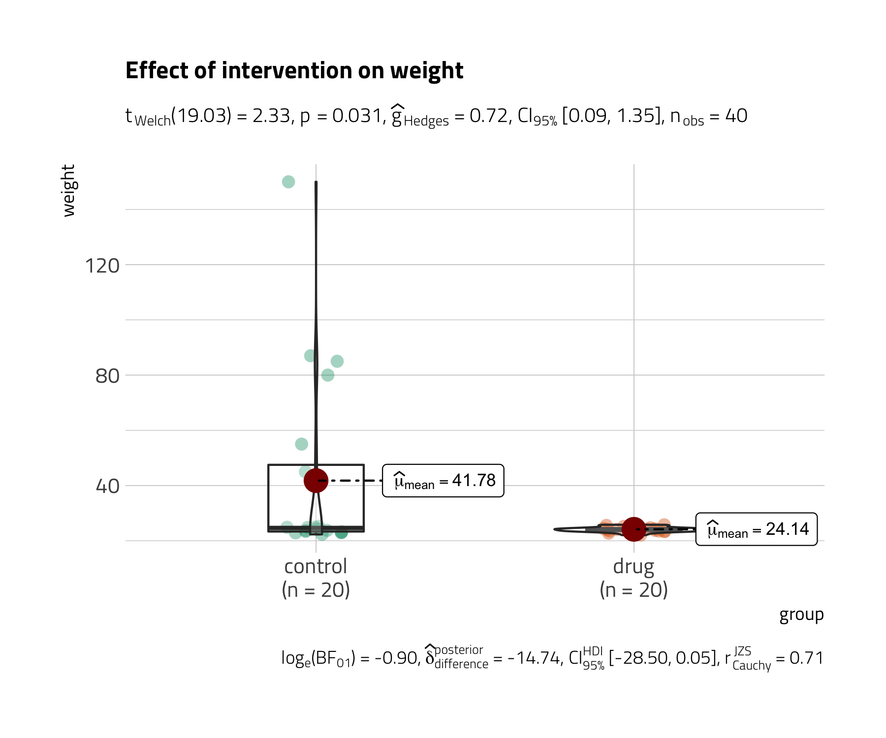

<style type="text/css">
body, td {
  font-size: 16px;
}
code.r{
  font-size: 14px;
}
</style>

```{r setup, include = FALSE}
future::plan("multicore")
knitr::opts_chunk$set(
  fig.width = 7,
  fig.height = 5,
  fig.retina = 2,
  fig.align = "center",
  out.width = "100%",
  dpi = 300,
  message = FALSE,
  warning = FALSE,
  cache = TRUE,
  autodep = TRUE,
  hiline = TRUE
)

knitr::opts_hooks$set(fig.callout = function(options) {
  if (options$fig.callout) {
    options$echo <- FALSE
    options$out.height <- "99%"
    options$fig.width <- 16
    options$fig.height <- 8
  }
  options
})

options(
  htmltools.dir.version = FALSE,
  width = 90,
  max.print = 9999,
  knitr.table.format = "html",
  crayon.enabled = TRUE
)
```

---

layout: true

# Plan

---

- Why `ggstatsplot`?

- Primary functions

- Benefits and customizability

- Misconceptions 

- Limitations and Future scope

---

layout: false

class: inverse, center, middle

# Why *ggstatsplot*?

---

layout: true

# Raison d'être

---

--

.right-column[

.font130[
Current count of packages on the Comprehensive R Archive Network (**CRAN**)
**<font color="red"> > 16,000</font>**
]

.footnote[<https://cran.r-project.org/web/packages/>]

]

--

.left-column[

]

--

.right-column[.font130[
Short answer: <br>
`ggstatsplot` provides a collection of <font color="blue">*information-rich*</font> plots with <font color="blue">*statistical details*</font> and is suitable for scholarly publications and **faster** (exploratory) data analysis.
]
]

---

layout: true

# Simpler data analysis workflow

---

--

.img-center[

]

.footnote[[(Grolemund & Wickham, *R for Data Science*, 2017)](https://r4ds.had.co.nz/)]

--

 <br>
 <br>
 <br>
 <br>
 <br>
 <br>
 <br>
 <br>
In a typical *exploratory* data analysis workflow, <font color="blue">data visualization</font> and <font color="blue">statistical modeling</font> are two different phases: visualization informs modeling,
and modeling can suggest a different visualization, and so on and so forth. 

--

The central idea of **ggstatsplot** is simple: combine these two phases into one!

---

layout: true

class: center

# Information-rich graphic is worth a thousand words

---

--

.img-center[

]


.footnote[[(Matejka & Fitzmaurice, *Autodesk Research*, 2017)](https://www.autodeskresearch.com/publications/samestats)]

 <br>
 <br>
 <br>
 <br>
 <br>
 <br>
 <br>
 <br>
 <br>
 <br>
 <br>
.font120[“I plotted my data and what I found surprised me!" - BuzzFeed]

---

layout: false

# Ready-made plot = no customization

--

The **grammar of graphics** (implemented in `ggplot2`) is a powerful
framework [(Wilkinson, 2011)](https://www.google.com/books/edition/_/iI1kcgAACAAJ?hl=en&sa=X&ved=2ahUKEwiGl8rJ2KztAhWyElkFHa8NAvkQre8FMBR6BAgMEAc) to prepare graphics and can help you make
infinite number of graphics, each tailored for your specific data visualization
problem! But...

--

.pull-left[

]

.pull-right[

]

<!-- --- -->

<!-- layout: false -->

<!-- # Consistent API = No cognitive fatigue -->

<!-- -- -->

<!-- .pull-left[ -->

<!-- ```{r lm, eval = FALSE} -->
<!-- stats::lm(formula = wt ~ mpg, data = mtcars) -->
<!-- ``` -->

<!-- ```{r cor, eval = FALSE} -->
<!-- stats::cor(x = mtcars$wt, y = mtcars$mpg) -->
<!-- ``` -->

<!-- ```{r cor.test, eval = FALSE} -->
<!-- stats::cor.test(formula = ~ wt + mpg, data = mtcars) -->
<!-- ``` -->

<!-- ] -->

<!-- -- -->

<!-- .img-left-small[ -->
<!--  -->
<!-- ] -->

<!-- -- -->

<!-- .pull-right[ -->
<!-- Functions in `ggstatsplot`- -->

<!-- `r emo::ji("check")` expect **dataframe** <br> -->
<!-- `r emo::ji("check")` expect **tidy** data <br> -->
<!-- `r emo::ji("check")` have consistent API (`foo(data, x, ...)`) <br> -->
<!-- ] -->

<!-- -- -->

<!-- .img-right-small[ -->
<!--  -->
<!-- ] -->

---

layout: false

class: inverse, center, middle

# And a LOT more!
...but we will come back to that later 📌

Let's get started first!

---

layout: false

# Installation

--

Install the stable version (latest: `0.7.0`) of **ggstatsplot** from 
[CRAN](https://cran.r-project.org/web/packages/ggstatsplot/index.html):

```{r utils, eval = FALSE, tidy = FALSE}
install.packages("ggstatsplot")
```
--

You can get the development version of the package from
[Github](https://github.com/IndrajeetPatil/ggstatsplot):

```{r github, eval = FALSE, tidy = FALSE}
remotes::install_github("IndrajeetPatil/ggstatsplot")
```

--

Load the needed packages-

```{r load, eval = TRUE, warning=FALSE}
library(ggstatsplot)
library(ggplot2)
```

---

layout: false

class: inverse, center, middle

# Primary functions

---

layout: false

class: inverse, center, middle

# Hypothesis about group differences

`r emo::ji("science")` *ggbetweenstats*, *ggwithinstats*: multiple groups

`r emo::ji("science")` *gghistostats*, *ggdotplotstats*: single group

---

layout: true

# ggbetweenstats - For between group comparisons

---

.left-code[
```{r ggbetweenstats_1, eval = FALSE}
ggbetweenstats(
  data = movies_long,
  x = mpaa,
  y = rating
)
```

.font70[
Function internally decides tests

- *t*-test if **2** groups
- ANOVA if **> 2** groups

`r emo::ji("pencil")` **Defaults** return <br>

`r emo::ji("check")` raw data + distributions <br>
`r emo::ji("check")` descriptive statistics <br>
`r emo::ji("check")` inferential statistics <br>
`r emo::ji("check")` effect size + CIs <br>
`r emo::ji("check")` pairwise comparisons <br>
`r emo::ji("check")` Bayesian hypothesis-testing <br>
`r emo::ji("check")` Bayesian estimation <br>
]

]

.right-plot[
```{r ggbetweenstats_1, ref.label = 'ggbetweenstats_1', echo = FALSE}
```
]

---

layout: true

# ggbetweenstats - pairwise comparisons

---

.left-code[
```{r ggbetweenstats_2, eval = FALSE}
ggbetweenstats(
  data = movies_long,
  x = mpaa,
  y = rating,
  type = "np", #<<
  pairwise.display = "ns" #<<
)
```

.font70[
Changing the `type` of test

`r emo::ji("check")` `"p"`  → **parametric** (default) <br>
`r emo::ji("check")` `"np"` → **non-parametric** <br>
`r emo::ji("check")` `"r"`  → **robust**  <br>
`r emo::ji("check")` `"bf"` → **Bayesian**

Changing pairwise comparisons displayed

ℹ️ `"ns"`  → only **non-significant**  <br>
ℹ️ `"s"`   → only **significant**  <br>
ℹ️ `"all"` → **all**
]

]

.right-plot[
```{r ggbetweenstats_2, ref.label = 'ggbetweenstats_2', echo = FALSE}
```
]

---

layout: true

# ggbetweenstats - outlier tagging

---

.left-code[
```{r ggbetweenstats_3, eval = FALSE}
ggbetweenstats(
  data = movies_long,
  x = mpaa,
  y = rating,
  type = "r",
  pairwise.comparisons = FALSE,
  outlier.tagging = TRUE, #<<
  outlier.label = title #<<
)
```

.font70[
[Tukey's fences](https://en.wikipedia.org/wiki/Outlier#Tukey's_fences) method using 
interquartile range flags outliers.

Centrality measures

`r emo::ji("check")` `"p"`  → $\mu_{mean}$  <br>
`r emo::ji("check")` `"np"` → $\mu_{median}$  <br>
`r emo::ji("check")` `"r"`  → $\mu_{trimmed}$  <br>
`r emo::ji("check")` `"bf"` → $\mu_{MAP}$
]

]

.right-plot[
```{r ggbetweenstats_3, ref.label = 'ggbetweenstats_3', echo = FALSE}
```
]

---

layout: true

# ggwithinstats - repeated measures equivalent

---

.left-code[
```{r ggwithinstats_1, eval = FALSE}
ggwithinstats(
  data = WRS2::WineTasting,
  x = Wine,
  y = Taste
)
```

.font70[
`r emo::ji("pencil")` **Defaults** return <br>

`r emo::ji("check")` raw data + distributions <br>
`r emo::ji("check")` descriptive statistics <br>
`r emo::ji("check")` inferential statistics <br>
`r emo::ji("check")` effect size + CIs <br>
`r emo::ji("check")` pairwise comparisons <br>
`r emo::ji("check")` Bayesian hypothesis-testing <br>
`r emo::ji("check")` Bayesian estimation <br>

Changing the `type` of test

`r emo::ji("check")` `"p"`  → **parametric** (default) <br>
`r emo::ji("check")` `"np"` → **non-parametric** <br>
`r emo::ji("check")` `"r"`  → **robust**  <br>
`r emo::ji("check")` `"bf"` → **Bayesian**
]
]

.right-plot[
```{r ggwithinstats_1, ref.label = 'ggwithinstats_1', echo = FALSE}
```
]

---

layout: true

# gghistostats - Distribution of a numeric variable

---

.left-code[
```{r gghistostats_1, eval = FALSE}
gghistostats(
  data = movies_long,
  x = budget,
  test.value = 30 #<<
)
```

.font70[
`r emo::ji("pencil")` **Defaults** return <br>

`r emo::ji("check")` counts + proportion for bins <br>
`r emo::ji("check")` descriptive statistics <br>
`r emo::ji("check")` inferential statistics <br>
`r emo::ji("check")` effect size + CIs <br>
`r emo::ji("check")` Bayesian hypothesis-testing <br>
`r emo::ji("check")` Bayesian estimation <br>

Centrality measures

`r emo::ji("check")` `"p"`  → $\mu_{mean}$  <br>
`r emo::ji("check")` `"np"` → $\mu_{median}$  <br>
`r emo::ji("check")` `"r"`  → $\mu_{trimmed}$  <br>
`r emo::ji("check")` `"bf"` → $\mu_{MAP}$
]
]

.right-plot[
```{r gghistostats_1, ref.label = 'gghistostats_1', echo = FALSE}
```
]

---

layout: true

# ggdotplotstats - Labeled numeric variable

---

.left-code[
```{r ggdotplotstats_1, eval = FALSE}
ggdotplotstats(
  data = movies_long,
  x = budget,
  y = genre,
  test.value = 30 #<<
)
```

.font70[
`r emo::ji("pencil")` **Defaults** return <br>

`r emo::ji("check")` descriptive statistics <br>
`r emo::ji("check")` inferential statistics <br>
`r emo::ji("check")` effect size + CIs <br>
`r emo::ji("check")` Bayesian hypothesis-testing <br>
`r emo::ji("check")` Bayesian estimation <br>

Centrality measures

`r emo::ji("check")` `"p"`  → $\mu_{mean}$  <br>
`r emo::ji("check")` `"np"` → $\mu_{median}$  <br>
`r emo::ji("check")` `"r"`  → $\mu_{trimmed}$  <br>
`r emo::ji("check")` `"bf"` → $\mu_{MAP}$
]
]

.right-plot[
```{r ggdotplotstats_1, ref.label = 'ggdotplotstats_1', echo = FALSE}
```
]

---

layout: false

class: inverse, center, middle

# Hypothesis about correlation
 <br>
`r emo::ji("science")` *ggscatterstats*: Two numeric variables
 <br>
`r emo::ji("science")` *ggcorrmat*: Multiple numeric variables

---

layout: true

# ggscatterstats - Two numeric variables

---

.left-code[
```{r ggscatterstats_1, eval = FALSE}
ggscatterstats(
  data = movies_long,
  x = budget,
  y = rating
)
```

.font70[
`r emo::ji("pencil")` **Defaults** return <br>

`r emo::ji("check")` raw data + distributions <br>
`r emo::ji("check")` marginal distributions <br>
`r emo::ji("check")` inferential statistics <br>
`r emo::ji("check")` effect size + CIs <br>
`r emo::ji("check")` Bayesian hypothesis-testing <br>
`r emo::ji("check")` Bayesian estimation <br>

Changing the `type` of test

`r emo::ji("check")` `"p"`  → **parametric** (default) <br>
`r emo::ji("check")` `"np"` → **non-parametric** <br>
`r emo::ji("check")` `"r"`  → **robust**  <br>
`r emo::ji("check")` `"bf"` → **Bayesian**
]
]

.right-plot[
```{r ggscatterstats_1, ref.label = 'ggscatterstats_1', echo = FALSE}
```
]

---

layout: true

# ggscatterstats - conditional point tagging

---

.left-code[
```{r ggscatterstats_2, eval = FALSE}
ggscatterstats(
  data = movies_long,
  x = budget,
  y = rating,
  type = "r",
  label.var = title, #<<
  label.expression = budget > 150 #<<
  & rating > 7.5, #<<
  marginal.type = "boxplot" #<<
)
```

.font70[
Changing the marginal type

ℹ️ **histogram** <br>
ℹ️ **boxplot** <br>
ℹ️ **density** <br>
ℹ️ **violin** <br>
ℹ️ **densigram**
]
]

.right-plot[
```{r ggscatterstats_2, ref.label = 'ggscatterstats_2', echo = FALSE}
```
]

---

layout: true

# ggcorrmat - multiple numeric variables

---

.left-code[
```{r ggcorrmat_1, eval = FALSE}
ggcorrmat(dplyr::starwars)
```

.font70[
`r emo::ji("pencil")` **Defaults** return <br>

`r emo::ji("check")` effect size + significance <br>
`r emo::ji("check")` careful handling of `NA`s

Changing the `type` of test

`r emo::ji("check")` `"p"`  → **parametric** (default) <br>
`r emo::ji("check")` `"np"` → **non-parametric** <br>
`r emo::ji("check")` `"r"`  → **robust**  <br>
`r emo::ji("check")` `"bf"` → **Bayesian**

]
]

.right-plot[
```{r ggcorrmat_1, ref.label = 'ggcorrmat_1', echo = FALSE}
```
]

---

layout: true

# ggcorrmat - getting a dataframe

---

.font70[
In addition to `output = "plot"`, this function can also be used to get a <font color="blue">dataframe</font>:
]

.font50[
```{r ggcorrmat_2}
library(ggplot2) # for data
options(digits = 2)

ggcorrmat(
  data = dplyr::select(msleep, sleep_rem, awake, brainwt),
  type = "bayes",
  output = "dataframe" #<<
)
```
]

.font70[
Partial correlations are also supported! 
Just set `partial = TRUE`.
]

---

layout: false

class: inverse, center, middle

# Hypothesis of composition of categorical variables
 <br>
`r emo::ji("science")` *ggpiestats*: If you like `r emo::ji("slice")`
 <br>
`r emo::ji("science")` *ggbarstats*: Otherwise

---

layout: true

# ggpiestats - goodness-of-fit test

---

.left-code[
```{r ggpiestats_1, eval = FALSE}
ggpiestats(
  data = as.data.frame(Titanic),
  x = Class,
  counts = Freq, #<<
  label = "both" #<<
)
```

.font70[
`r emo::ji("pencil")` **Defaults** return <br>

`r emo::ji("check")` descriptive statistics <br>
`r emo::ji("check")` inferential statistics <br>
`r emo::ji("check")` effect size + CIs <br>
`r emo::ji("check")` Bayesian hypothesis-testing <br>
🤞 Bayesian estimation <br>

**Note** <br>
If the data is in *tabled* 
format, you can use the `counts` 
argument.
]

]

.right-plot[
```{r ggpiestats_1, ref.label = 'ggpiestats_1', echo = FALSE}
```
]

---

layout: true

# ggpiestats - association between categorical variables

---

.left-code[
```{r ggpiestats_2, eval = FALSE}
# let's use subset of data
ggpiestats(
  data = dplyr::filter(
    movies_long,
    genre %in% c("Drama", "Comedy")
  ),
  x = mpaa,
  y = genre
)
```

.font70[
`r emo::ji("pencil")` **Defaults** return <br>

`r emo::ji("check")` descriptive statistics <br>
`r emo::ji("check")` inferential statistics <br>
`r emo::ji("check")` effect size + CIs <br>
`r emo::ji("check")` Goodness-of-fit tests <br>
`r emo::ji("check")` Bayesian hypothesis-testing <br>
`r emo::ji("check")` Bayesian estimation <br>

Test by design

- `paired = FALSE` → Pearson's $\chi^2$
- `paired = TRUE` → McNemar's $\chi^2$

]
]

.right-plot[
```{r ggpiestats_2, ref.label = 'ggpiestats_2', echo = FALSE}
```
]

---

layout: true

# ggbarstats - association between categorical variables

---

.left-code[
```{r ggbarstats_1, eval = FALSE}
ggbarstats(
  data = dplyr::filter(
    movies_long,
    genre %in% c("Drama", "Comedy")
  ),
  x = mpaa,
  y = genre
)
```

.font70[
`r emo::ji("pencil")` **Defaults** return <br>

`r emo::ji("check")` descriptive statistics <br>
`r emo::ji("check")` inferential statistics <br>
`r emo::ji("check")` effect size + CIs <br>
`r emo::ji("check")` Goodness-of-fit tests <br>
`r emo::ji("check")` Bayesian hypothesis-testing <br>
`r emo::ji("check")` Bayesian estimation <br>

Test by design

- `paired = FALSE` → Pearson's $\chi^2$
- `paired = TRUE` → McNemar's $\chi^2$
]
]

.right-plot[
```{r ggbarstats_1, ref.label = 'ggbarstats_1', echo = FALSE}
```
]

---

layout: false

class: inverse, center, middle

# Hypothesis about regression coefficients

`r emo::ji("science")` *ggcoefstats*: Regression model object

---

layout: true

# ggcoefstats

---

.left-code[
```{r ggcoefstats_1, eval = FALSE}
# model
mod <- stats::lm(
  formula = rating ~ mpaa,
  data = movies_long
)

# plot
ggcoefstats(
  x = mod,
  title = "IMDB rating by MPAA rating"
)
```

.font70[
`r emo::ji("pencil")` **Defaults** return <br>

`r emo::ji("check")` estimate + CIs <br>
`r emo::ji("check")` inferential statistics <br>
`r emo::ji("check")` model summary (AIC + BIC)
]

]

.right-plot[
```{r ggcoefstats_1, ref.label = 'ggcoefstats_1', echo = FALSE}
```
]

---

layout: true

# ggcoefstats: Supported models

---

.font60[
`aareg`, `afex_aov`, `anova`, `anova.mlm`, `anova`, `aov`, `aovlist`, `Arima`,
`bam`, `bayesx`, `bayesGARCH`, `BBmm`, `BBreg`, `bcplm`, `betamfx`, `betaor`,
`BFBayesFactor`, `bglmerMod`, `bife`, `bigglm`, `biglm`, `blavaan`, `bmlm`,
`blmerMod`, `bracl`, `brglm`, `brglm2`, `brmsfit`, `brmultinom`, `btergm`,
`cch`, `censReg`, `cgam`, `cgamm`, `cglm`, `clm`, `clm2`, `clmm`, `clmm2`,
`coeftest`, `complmrob`, `confusionMatrix`, `coxme`, `coxph`, `coxph.penal`,
`cpglm`, `cpglmm`, `crch`, `crq`, `crr`, `DirichReg`, `drc`, `eglm`, `elm`,
`emmGrid`, `epi.2by2`, `ergm`, `feis`, `felm`, `fitdistr`, `fixest`,
`flexsurvreg`, `gam`, `Gam`, `gamlss`, `garch`, `geeglm`, `glmc`, `glmerMod`,
`glmmTMB`, `gls`, `glht`, `glm`, `glmm`, `glmmadmb`, `glmmPQL`, `glmRob`,
`glmrob`, `glmx`, `gmm`, `HLfit`, `hurdle`, `ivFixed`, `ivprobit`, `ivreg`,
`iv_robust`, `lavaan`, `lm`, `lm.beta`, `lmerMod`, `lmerModLmerTest`, `lmodel2`,
`lmRob`, `lmrob`, `lm_robust`, `logitmfx`, `logitor`, `logitsf`, `LORgee`,
`lqm`, `lqmm`, `lrm`, `manova`, `maov`, `margins`, `mcmc`, `mcmc.list`,
`MCMCglmm`, `mclogit`, `mice`, `mmclogit`, `mediate`, `metafor`, `merMod`,
`merModList`, `metaplus`, `mixor`, `mjoint`, `mle2`, `mlm`, `multinom`,
`negbin`, `negbinmfx`, `negbinirr`, `nlmerMod`, `nlrq`, `nlreg`, `nls`,
`orcutt`, `orm`, `plm`, `poissonmfx`, `poissonirr`, `polr`, `ridgelm`,
`riskRegression`, `rjags`, `rlm`, `rlmerMod`, `robmixglm`, `rq`, `rqs`, `rqss`,
`rrvglm`, `scam`, `semLm`, `semLme`, `slm`, `speedglm`, `speedlm`, `stanfit`,
`stanreg`, `summary.lm`, `survreg`, `svyglm`, `svyolr`, `svyglm`, `tobit`,
`truncreg`, `varest`, `vgam`, `vglm`, `wbgee`, `wblm`, `zeroinfl`, etc.
]

--

Thanks to [`easystats`](https://easystats.github.io/easystats/)!


---

layout: false

class: inverse, center, middle

# *grouped_* variants of all functions
Running the same function for 
all levels of a single grouping variable

---

layout: true

# *grouped_* functions

---

--

.left-code[
```{r grouped_1, eval = FALSE}
grouped_ggpiestats(
  data = mtcars,
  x = cyl,
  grouping.var = am #<<
)
```

.font70[
Available `grouped_` variants
- `grouped_ggbetweenstats`
- `grouped_ggwithinstats`
- `grouped_gghistostats`
- `grouped_ggdotplotstats`
- `grouped_ggscatterstats`
- `grouped_ggcorrmat`
- `grouped_ggpiestats`
- `grouped_ggbarstats`
]
]

.right-plot[
```{r grouped_1, ref.label = 'grouped_1', echo = FALSE}
```
]

---

layout: false

class: inverse, center, middle

# Customizability of *ggstatsplot*
"What if I don't like the default plots?" 🤔

---

<!-- exclude: false -->

<!-- layout: true -->

<!-- # Defaults -->

<!-- --- -->

<!-- exclude: false -->

<!-- .pull-left[ -->
<!-- .font100[ -->
<!-- The default plots in *<font color="blue">ggstatsplot</font>* are -->
<!-- **opinionated**, yes, but they try to follow best practices outlined in the data visualization research. -->
<!-- ] -->
<!-- ] -->

<!-- .pull-right[ -->
<!--  -->
<!-- ] -->

---

layout: true

# Changing aesthetics (themes + palettes) 🖼🎨

---

Aesthetic preferences are not an excuse to not use `ggstatsplot`! `r emo::ji("heart_eyes_cat")`

--

.left-code[
```{r ggbetweenstats_4, eval = FALSE}
ggbetweenstats(
  data = movies_long,
  x = mpaa,
  y = rating,
  ggtheme = hrbrthemes::theme_ipsum_tw(), #<<
  palette = "Darjeeling2", #<<
  package = "wesanderson" #<<
)
```

.font70[
The default palette 
is **colorblind-friendly**.
]
]

.right-plot[
```{r ggbetweenstats_4, ref.label = 'ggbetweenstats_4', echo = FALSE}
```
]

---

layout: true

# Further modification with *ggplot2* 🛠

---

You can modify `ggstatsplot` plots further using `ggplot2` functions. 🎉

.left-code[
```{r ggbetweenstats_5, eval = FALSE}
ggbetweenstats(
  data = mtcars,
  x = am,
  y = wt,
  type = "bayes"
) +
  scale_y_continuous(sec.axis = dup_axis()) #<<
```

.img-left-small[

]

]

.right-plot[
```{r ggbetweenstats_5, ref.label = 'ggbetweenstats_5', echo = FALSE}
```
]

---

layout: true

# Too much information 🙈

---

`ggstatsplot` can be used to get **only plots**.

--

.left-code[
```{r only_plot, eval = FALSE}
# using `ggstatsplot` only for plot
ggbetweenstats(
  data = iris,
  x = Species,
  y = Sepal.Length,
  # turn off centrality measure
  centrality.plotting = FALSE, #<<
  # turn off statistical analysis
  results.subtitle = FALSE, #<<
  # turn off Bayesian message
  bf.message = FALSE, #<<
  # turn off pairwise comparisons
  pairwise.comparisons = FALSE #<<
)
```
]

.right-plot[
```{r only_plot, ref.label = 'only_plot', echo = FALSE}
```
]

---


layout: true

# Expressions for custom plots 🀄️

---

`ggstatsplot` can be used to get **only the expressions**.

--

.left-code[
```{r subtitle_1, eval = FALSE}
# using `ggstatsplot` for stats
results <-
  ggstatsplot::ggpiestats(
    data = Titanic_full,
    x = Survived,
    y = Sex,
    output = "subtitle" #<<
  )

# using `ggiraphExtra` for plot
ggiraphExtra::ggSpine( #<<
  data = Titanic_full,
  aes(x = Sex, fill = Survived),
  addlabel = TRUE,
  interactive = FALSE
) + 
  labs(subtitle = results) #<<
```
]

.right-plot[
```{r subtitle_1, ref.label = 'subtitle_1', echo = FALSE}
```
]

---

layout: false

class: inverse, center, middle

# Why use *ggstatsplot*? 👍️

---

layout: false

# Supports different statistical approaches 

--

Functions | Description | Parametric | Non-parametric | Robust | Bayesian
------- | ------------------ | ---- | ----- | ----| ----- 
`ggbetweenstats` | Between group comparisons | **<font color="green">Yes</font>** | **<font color="green">Yes</font>** | **<font color="green">Yes</font>** | **<font color="green">Yes</font>**
`ggwithinstats` | Within group comparisons | **<font color="green">Yes</font>** | **<font color="green">Yes</font>** | **<font color="green">Yes</font>** | **<font color="green">Yes</font>**
`gghistostats`, `ggdotplotstats` | Distribution of a numeric variable | **<font color="green">Yes</font>** | **<font color="green">Yes</font>** | **<font color="green">Yes</font>** | **<font color="green">Yes</font>**
`ggcorrmat` | Correlation matrix | **<font color="green">Yes</font>** | **<font color="green">Yes</font>** | **<font color="green">Yes</font>** | **<font color="green">Yes</font>**
`ggscatterstats` | Correlation between two variables | **<font color="green">Yes</font>** | **<font color="green">Yes</font>** | **<font color="green">Yes</font>** | **<font color="green">Yes</font>**
`ggpiestats`, `ggbarstats` | Association between categorical variables | **<font color="green">Yes</font>** | `NA` | `NA` | **<font color="green">Yes</font>**
`ggpiestats`, `ggbarstats` | Equal proportions for categorical variable levels | **<font color="green">Yes</font>** | `NA` | `NA` | **<font color="green">Yes</font>**
`ggcoefstats` | Regression modeling | **<font color="green">Yes</font>** | **<font color="green">Yes</font>** | **<font color="green">Yes</font>** | **<font color="green">Yes</font>**
`ggcoefstats` | Random-effects meta-analysis | **<font color="green">Yes</font>** | `NA` | **<font color="green">Yes</font>** | **<font color="green">Yes</font>**

---

layout: false

# One package to access it all 💍

--

.pull-left[

.font90[
**Load 'em up!**

📦 to carry out the test (e.g. `stats`) <br>
📦 computing effect size + CIs (e.g. `effectsize`) <br>
📦 for descriptives (e.g. `skimr`) <br>
📦 pairwise comparisons (e.g. `multcomp`) <br>
📦 Bayesian hypothesis testing (e.g. `BayesFactor`) <br>
📦 Bayesian estimation (e.g. `bayestestR`) <br>
📦 . <br>
📦 . <br>
]

.img-left-small[

]

]

--

.pull-right[

.font90[
**Root of headache**

🤔 accepts dataframe, vectors, matrix? <br>
🤔 long/wide format data? <br>
🤔 works with `NA`s? <br>
🤔 returns list, dataframe, arrays? <br>
🤔 works with tibbles? <br>

.img-right-small[

]

]

]

---

layout: false

# Toggling between statistical approaches 🔀

--

.pull-left[
**<font color="blue">Parametric<font>**
```{r type_p, eval = FALSE}
# anova
ggbetweenstats(
  data = mtcars,
  x = cyl,
  y = wt,
  type = "p" #<<
)

# correlation analysis
ggscatterstats(
  data = mtcars,
  x = wt,
  y = mpg,
  type = "p" #<<
)

# t-test
gghistostats(
  data = mtcars,
  x = wt,
  test.value = 2,
  type = "p" #<<
)
```
]

--

.pull-right[
**<font color="#ff6600">Non-parametric<font>** 
```{r type_np, eval = FALSE}
# anova
ggbetweenstats(
  data = mtcars,
  x = cyl,
  y = wt,
  type = "np" #<<
)

# correlation analysis
ggscatterstats(
  data = mtcars,
  x = wt,
  y = mpg,
  type = "np" #<<
)

# t-test
gghistostats(
  data = mtcars,
  x = wt,
  test.value = 2,
  type = "np" #<<
)
```
]

---

layout: false

# Results *in context* of the underlying data 🕵️

--

.pull-left[

**Without ggstatsplot**

The 20 participants who received the drug intervention $(M = 24.14)$ compared to
the 20 participants in the control group $(M = 41.78)$ demonstrated
significantly lower weight (Welch's $t$-test: $t(19.03) = 2.33, p = .031$). The
effect size $(g_{Hedges} = 0.72, 95\% CI [0.09,1.35])$ for this analysis was
found to exceed Cohen’s (1988) convention for a medium effect $(> .50)$.
]

--

.pull-right[

**With ggstatsplot**



]

---

---

layout: false

# Best practices in statistical reporting 🏆

--

The expression template tries to follow the APA gold standard for statistical
reporting.

For example, expression for a robust *t*-test:


<!-- --- -->

<!-- layout: false -->

<!-- # Statistically informed tests defaults -->

<!-- -- -->

<!-- The default tests follow the best practices. For example, -->

<!-- `r emo::ji("check")` `ggbetweenstats` and `ggwithinstats` default to <font color="blue">Welch's *t*-test</font> and <font -->
<!-- color="blue">Welch's ANOVA</font> - and not Student's *t*-test and Fisher's -->
<!-- ANOVA - based on recent work (Delacre et al., -->
<!-- [2017](https://www.rips-irsp.com/article/10.5334/irsp.82/), -->
<!-- [2018](https://psyarxiv.com/wnezg)). -->

<!-- `r emo::ji("check")` Functions default to reporting unbiased effect size measures (Lakens, [2013](https://www.frontiersin.org/articles/10.3389/fpsyg.2013.00863/full)). -->

<!-- `r emo::ji("check")` Whenever multiple tests are carried out, *p*-values are adjusted for them by default. -->

<!-- etc. -->

---

layout: false

# Avoiding reporting errors

--

> "half of all published psychology papers that use NHST contained at least one
p-value that was inconsistent with its test statistic and degrees of freedom.
One in eight papers contained a grossly inconsistent p-value that may have
affected the statistical conclusion"

> [(Nuijten et al., *Behavior Research Methods*, 2016)](https://link.springer.com/article/10.3758/s13428-015-0664-2)

--

Since the plot and the statistical analysis are yoked together, the chances of
making an error in reporting the results are minimized.

---

layout: false

# Making sense of null results

--

$p > 0.05$: The null hypothesis (`H0`) can't be rejected

But can it be **accepted**?! NHST 🤫

--

> "In 72% of cases, nonsignificant results were misinterpreted, in that the
authors inferred that the effect was absent. A Bayesian reanalysis revealed
that fewer than 5% of the nonsignificant findings provided strong evidence
(i.e., $BF_{01} > 10$) in favor of the null hypothesis over the alternative
hypothesis."

> [(Aczel et al., *AMPPS*, 2018)](https://journals.sagepub.com/doi/pdf/10.1177/2515245918773742)

--

Juxtaposing frequentist and Bayesian statistics for the same analysis helps to
properly interpret the null results.

---

layout: true

# A few additional benefits

---

--

- Minimal amount of code needed (typically only `data`, `x`,
  and `y`), which minimizes chances of error and makes for tidy scripts. 💅

--

- Truly makes your figures worth a thousand words. 💬

--

- No need to copy-paste results to the text editor (MS-Word, e.g.). 🙅

--

- Disembodied figures stand on their own and are easy to evaluate for the reader. 🧐

--

- More breathing room for theoretical discussion and other text. ✍

--

- No need to worry about updating figures and statistical details separately. 🔗

---

layout: false

class: inverse, center, middle

# Misconceptions and limitations

---

layout: true

# Misconceptions about *ggstatsplot*

---

--

This package is... 

--

`r emo::ji("x")` an alternative to learning `ggplot2` <br>
--
`r emo::ji("check")` (the more you know `ggplot2`, the better you can modify the
defaults to your liking)

--

`r emo::ji("x")` meant to be used in talks/presentations <br>
--
`r emo::ji("check")` (default plots can be too complicated for effectively
communicating results in time-constrained presentation settings, e.g. conference
talks)

--

`r emo::ji("x")` meant for mass communication <br>
--
`r emo::ji("check")` LOL 😆

--

`r emo::ji("x")` the only game in town <br>
--
`r emo::ji("check")` (GUI open-source softwares: [JASP](https://jasp-stats.org/) and [jamovi](https://www.jamovi.org/))

---

layout: true

# Limitations of *ggstatsplot* 👎️

---

--

- Limited kinds of <font color="blue">plots</font> available. 

--

- Limited number of statistical <font color="blue">tests</font> available.
  This will **always** be the case. 🤷

--

- Expects a non-trivial level of statistical proficiency (but plots without
  statistics can still be useful).

--

- <font color="blue">Faceting</font> not implemented.

---

layout: true

# Overcoming these limitations 👥

---

--

.pull-left[

.font90[
Contributions (big or small) welcome!
]


]

--

.pull-right[
.font90[
Ways in which you can [contribute](https://github.com/IndrajeetPatil/ggstatsplot)

- Read and correct any inconsistencies in the
[documentation](https://indrajeetpatil.github.io/ggstatsplot/) 📖

- Raise issues about bugs/features 🐞

- Review code 🕵

- Add new functionality `r emo::ji("developer")`

- Either mention or cite software if used in a publication 📝
]
]

---

layout: false

class: inverse, center, middle

# Acknowledgments

--

Other developers 🙌

[Daniel Lüdecke](https://github.com/strengejacke), [Dominique Makowski](https://github.com/DominiqueMakowski), [Mattan S. Ben-Shachar](https://github.com/mattansb)

--

Support 💰

[Mina Cikara](http://www.intergroupneurosciencelaboratory.com/), [Fiery Cushman](http://cushmanlab.fas.harvard.edu/index.php), [Iyad Rahwan](https://rahwan.me/)

--

Community 🙏

Contributors to *ggstatsplot* &
*rstats* users and developers


<!-- The CSS template comes from [Garrick Aden-Buie](https://github.com/gadenbuie/gentle-ggplot2) -->

---

layout: false

class: inverse, center, middle

# Find me at...

.font100[

[`r emo::ji("bird")` @patilindrajeets](http://twitter.com/patilindrajeets)

[`r emo::ji("computer")` @IndrajeetPatil](http://github.com/IndrajeetPatil)  

[`r emo::ji("link")` https://sites.google.com/site/indrajeetspatilmorality/](https://sites.google.com/site/indrajeetspatilmorality/)  

[`r emo::ji("mail")` patilindrajeet.science@gmail.com](mailto:patilindrajeet.science@gmail.com)

]

---

layout: false

class: inverse, center, middle

# For more information, see

https://indrajeetpatil.github.io/ggstatsplot/
