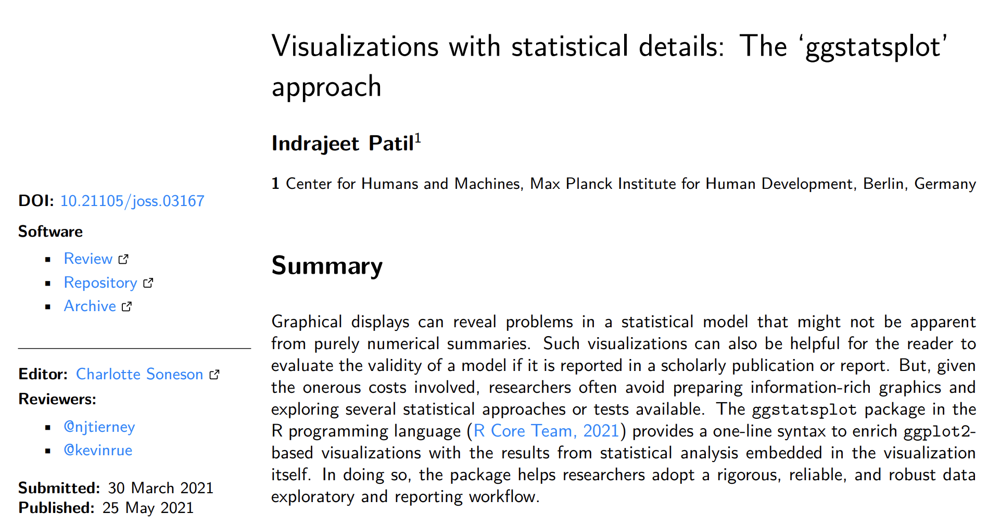
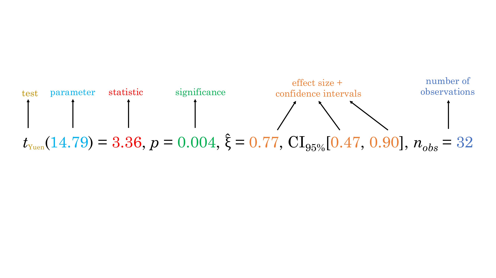

<style type="text/css">
body, td {
  font-size: 16px;
}
code.r{
  font-size: 14px;
}
</style>

```{r setup, include=FALSE}
knitr::opts_chunk$set(
  fig.width = 7,
  fig.height = 5,
  fig.retina = 2,
  fig.align = "center",
  out.width = "100%",
  dpi = 300,
  message = FALSE,
  warning = FALSE,
  cache = TRUE,
  autodep = TRUE,
  hiline = TRUE
)

knitr::opts_hooks$set(fig.callout = function(options) {
  if (options$fig.callout) {
    options$echo <- FALSE
    options$out.height <- "99%"
    options$fig.width <- 16
    options$fig.height <- 8
  }
  options
})

options(
  htmltools.dir.version = FALSE,
  width = 90,
  max.print = 9999,
  knitr.table.format = "html",
  crayon.enabled = TRUE
)
```

```{r xaringanExtra-search, echo=FALSE}
xaringanExtra::use_search(show_icon = TRUE)
```

---

layout: true

# Plan

---

- Why `ggstatsplot`?

- Primary functions

- Customizability

- Benefits

- Misconceptions 

- Limitations

- Future plans

---

layout: false

class: inverse, center, middle

# Why *ggstatsplot*?

---

layout: true

class: center

# Raison d'être

---

--

.right-column[

.font120[
Current count of packages on the Comprehensive R Archive Network (`CRAN`) **> 16,000**
]

]

--

.left-column[

]

--

.right-column[.font110[

.content-box-yellow[
In short, `ggstatsplot` returns <br>
<br>
📊 .blue[information-rich] plots with .blue[statistical details] <br>
 
📝 suitable for .blue[faster] (exploratory) data analysis and scholarly publications
]

]
]

---

layout: true

class: center

# Quickest overview: Publication (~ 10 min read)

---

--

Can be read [here](https://joss.theoj.org/papers/10.21105/joss.03167).



---

layout: true

class: center

# Simpler/faster data analysis workflow

---

--

.img-center[

]

.footnote[[(Grolemund & Wickham, *R for Data Science*, 2017)](https://r4ds.had.co.nz/)]

--

 <br>
 <br>
 <br>
 <br>
 <br>
 <br>
 <br>
 <br>
In a typical *exploratory* data analysis workflow, .blue[data visualization] and .blue[statistical modeling] are two
different phases: visualization informs modeling, and modeling can suggest a
different visualization, and so on and so forth.

--

💡 The central idea of `ggstatsplot` is simple: combine these two phases into one!

---

layout: true

class: center

# Information-rich graphic is worth a thousand words

---

.img-center[

]


.footnote[[(Matejka & Fitzmaurice, *Autodesk Research*, 2017)](https://www.autodeskresearch.com/publications/samestats)]

--

 <br>
 <br>
 <br>
 <br>
 <br>
 <br>
 <br>
 <br>
 <br>
 
.blue[Graphical] summaries can reveal problems not visible from .blue[numerical] statistics.
 
_I plotted my data and what I found surprised me!_ - BuzzFeed

---

layout: false

class: center

# Ready-made plot = no customization

--

The .blue[grammar of graphics] is a powerful framework [(Wilkinson, 2011)](https://www.google.com/books/edition/_/iI1kcgAACAAJ?hl=en&sa=X&ved=2ahUKEwiGl8rJ2KztAhWyElkFHa8NAvkQre8FMBR6BAgMEAc) and can help you make *any* graphics fitting your specific data visualization needs! But...

--

.pull-left[

]

.pull-right[

]

--

$\sum_{time}$ (Needed time ↑ + Likelihood to graphical explore data ↓) = Avoidance habit

---

layout: false

class: inverse, center, middle

# And a LOT more!
...but we will come back to that later 📌

Let's get started first!

---

layout: false

# Installation

--

Install the stable version of `ggstatsplot` from 
[CRAN](https://cran.r-project.org/web/packages/ggstatsplot/index.html):

```{r utils, eval=FALSE}
install.packages("ggstatsplot")
```
--

You can get the development version of the package from
[Github](https://github.com/IndrajeetPatil/ggstatsplot):

```{r github, eval=FALSE}
remotes::install_github("IndrajeetPatil/ggstatsplot")
```

--

Load the needed packages-

```{r load, eval=TRUE, warning=FALSE}
library(ggstatsplot)
library(ggplot2)
```

---

layout: false

class: inverse, center, middle

# Primary functions

---

layout: false

class: inverse, center, middle

# Hypothesis about group differences

---

layout: true

# ggbetweenstats - For between group comparisons

---

--

.left-code[
```{r ggbetweenstats_1, eval=FALSE}
ggbetweenstats(
  data = movies_long,
  x = mpaa,
  y = rating
)
```

.font70[
Function internally decides tests

- *t*-test if `2` groups
- ANOVA if `> 2` groups

`r emo::ji("pencil")` .blue[Defaults] return <br>

✅ raw data + distributions <br>
✅ descriptive statistics <br>
✅ inferential statistics <br>
✅ effect size + CIs <br>
✅ pairwise comparisons <br>
✅ Bayesian hypothesis-testing <br>
✅ Bayesian estimation
]

]

--

.right-plot[
```{r ggbetweenstats_1, ref.label='ggbetweenstats_1', echo=FALSE}
```
]

---

layout: true

# ggbetweenstats - pairwise comparisons

---

--

.left-code[
```{r ggbetweenstats_2, eval=FALSE}
ggbetweenstats(
  data = movies_long,
  x = mpaa,
  y = rating,
  type = "np", #<<
  pairwise.display = "ns" #<<
)
```

.font70[
Changing the `type` of test

✅ `"p"`  &nbsp;&nbsp;→ **parametric** <br>
✅ `"np"` → **non-parametric** <br>
✅ `"r"`  &nbsp;&nbsp;→ **robust**  <br>
✅ `"bf"` → **Bayesian**

Changing pairwise comparisons displayed

ℹ️ `"ns"`  nbsp;&→ only **non-significant**  <br>
ℹ️ `"s"`   nbsp;&nbsp;→→ only **significant**  <br>
ℹ️ `"all"` → **all**
]

]

--

.right-plot[
```{r ggbetweenstats_2, ref.label='ggbetweenstats_2', echo=FALSE}
```
]

---

layout: true

# ggbetweenstats - outlier tagging

---

--

.left-code[
```{r ggbetweenstats_3, eval=FALSE}
ggbetweenstats(
  data = movies_long,
  x = mpaa,
  y = rating,
  type = "r",
  pairwise.comparisons = FALSE,
  outlier.tagging = TRUE, #<<
  outlier.label = title #<<
)
```

.font70[
[Tukey's fences](https://en.wikipedia.org/wiki/Outlier#Tukey's_fences) method using 
interquartile range flags outliers.

Centrality measures

✅ `"p"`  &nbsp;&nbsp;→ $\mu_{mean}$  <br>
✅ `"np"` → $\mu_{median}$  <br>
✅ `"r"`  &nbsp;&nbsp;→ $\mu_{trimmed}$  <br>
✅ `"bf"` → $\mu_{MAP}$
]

]

--

.right-plot[
```{r ggbetweenstats_3, ref.label='ggbetweenstats_3', echo=FALSE}
```
]

---

layout: true

# ggwithinstats - repeated measures equivalent

---

--

.left-code[
```{r ggwithinstats_1, eval=FALSE}
ggwithinstats(
  data = WRS2::WineTasting,
  x = Wine,
  y = Taste
)
```

.font70[
`r emo::ji("pencil")` .blue[Defaults] return <br>

✅ raw data + distributions <br>
✅ descriptive statistics <br>
✅ inferential statistics <br>
✅ effect size + CIs <br>
✅ pairwise comparisons <br>
✅ Bayesian hypothesis-testing <br>
✅ Bayesian estimation <br>

Changing the `type` of test

✅ `"p"`  &nbsp;&nbsp;→ **parametric** <br>
✅ `"np"` → **non-parametric** <br>
✅ `"r"`  &nbsp;&nbsp;→ **robust**  <br>
✅ `"bf"` → **Bayesian**
]
]

--

.right-plot[
```{r ggwithinstats_1, ref.label='ggwithinstats_1', echo=FALSE}
```
]

---

layout: true

# gghistostats - Distribution of a numeric variable

---

--

.left-code[
```{r gghistostats_1, eval=FALSE}
gghistostats(
  data = movies_long,
  x = budget,
  test.value = 30 #<<
)
```

.font70[
`r emo::ji("pencil")` .blue[Defaults] return <br>

✅ counts + proportion for bins <br>
✅ descriptive statistics <br>
✅ inferential statistics <br>
✅ effect size + CIs <br>
✅ Bayesian hypothesis-testing <br>
✅ Bayesian estimation <br>

Centrality measures

✅ `"p"`  &nbsp;&nbsp;→ $\mu_{mean}$  <br>
✅ `"np"` → $\mu_{median}$  <br>
✅ `"r"`  &nbsp;&nbsp;→ $\mu_{trimmed}$  <br>
✅ `"bf"` → $\mu_{MAP}$
]
]

--

.right-plot[
```{r gghistostats_1, ref.label='gghistostats_1', echo=FALSE}
```
]

---

layout: true

# ggdotplotstats - Labeled numeric variable

---

--

.left-code[
```{r ggdotplotstats_1, eval=FALSE}
ggdotplotstats(
  data = movies_long,
  x = budget,
  y = genre,
  test.value = 30 #<<
)
```

.font70[
`r emo::ji("pencil")` .blue[Defaults] return <br>

✅ descriptive statistics <br>
✅ inferential statistics <br>
✅ effect size + CIs <br>
✅ Bayesian hypothesis-testing <br>
✅ Bayesian estimation <br>

Centrality measures

✅ `"p"`  &nbsp;&nbsp;→ $\mu_{mean}$  <br>
✅ `"np"` → $\mu_{median}$  <br>
✅ `"r"`  &nbsp;&nbsp;→ $\mu_{trimmed}$  <br>
✅ `"bf"` → $\mu_{MAP}$
]
]

--

.right-plot[
```{r ggdotplotstats_1, ref.label='ggdotplotstats_1', echo=FALSE}
```
]

---

layout: false

class: inverse, center, middle

# Hypothesis about correlation

---

layout: true

# ggscatterstats - Two numeric variables

---

--

.left-code[
```{r ggscatterstats_1, eval=FALSE}
ggscatterstats(
  data = movies_long,
  x = budget,
  y = rating
)
```

.font70[
`r emo::ji("pencil")` .blue[Defaults] return <br>

✅ joint distribution <br>
✅ marginal distributions <br>
✅ inferential statistics <br>
✅ effect size + CIs <br>
✅ Bayesian hypothesis-testing <br>
✅ Bayesian estimation <br>

Changing the `type` of test

✅ `"p"`  &nbsp;&nbsp;→ **parametric** <br>
✅ `"np"` → **non-parametric** <br>
✅ `"r"`  &nbsp;&nbsp;→ **robust**  <br>
✅ `"bf"` → **Bayesian**
]
]

--

.right-plot[
```{r ggscatterstats_1, ref.label='ggscatterstats_1', echo=FALSE}
```
]

---

layout: true

# ggscatterstats - conditional point tagging

---

--

.left-code[
```{r ggscatterstats_2, eval=FALSE}
ggscatterstats(
  data = movies_long,
  x = budget,
  y = rating,
  type = "r",
  label.var = title, #<<
  label.expression = budget > 150 #<<
  & rating > 7.5
)
```
]

--

.right-plot[
```{r ggscatterstats_2, ref.label='ggscatterstats_2', echo=FALSE}
```
]

---

layout: true

# ggcorrmat - multiple numeric variables

---

--

.left-code[
```{r ggcorrmat_1, eval=FALSE}
ggcorrmat(dplyr::starwars)
```

.font70[
`r emo::ji("pencil")` .blue[Defaults] return <br>

✅ effect size + significance <br>
✅ careful handling of `NA`s

Changing the `type` of test

✅ `"p"`  &nbsp;&nbsp;→ **parametric** <br>
✅ `"np"` → **non-parametric** <br>
✅ `"r"`  &nbsp;&nbsp;→ **robust**  <br>
✅ `"bf"` → **Bayesian**

]
]

--

.right-plot[
```{r ggcorrmat_1, ref.label='ggcorrmat_1', echo=FALSE}
```
]

---

layout: true

# ggcorrmat - getting a dataframe

---

.font70[
In addition to `output="plot"`, this function can also be used to get a .blue[dataframe]:
]

.font50[
```{r ggcorrmat_2}
library(ggplot2) # for data
options(digits = 2)

ggcorrmat(
  data = dplyr::select(msleep, sleep_rem, awake, brainwt),
  type = "bayes",
  output = "dataframe" #<<
)
```
]

.font70[
Partial correlations are also supported! 
Just set `partial=TRUE`.
]

---

layout: false

class: inverse, center, middle

# Hypothesis of composition of categorical variables

---

layout: true

# ggpiestats - association between categorical variables

---

--

.left-code[
```{r ggpiestats_2, eval=FALSE}
# let's use subset of data
ggpiestats(
  data = dplyr::filter(
    movies_long,
    genre %in% c("Drama", "Comedy")
  ),
  x = mpaa,
  y = genre
)
```

.font70[
`r emo::ji("pencil")` .blue[Defaults] return <br>

✅ descriptive statistics <br>
✅ inferential statistics <br>
✅ effect size + CIs <br>
✅ Goodness-of-fit tests <br>
✅ Bayesian hypothesis-testing <br>
✅ Bayesian estimation <br>

]
]

--

.right-plot[
```{r ggpiestats_2, ref.label='ggpiestats_2', echo=FALSE}
```
]

---

layout: true

# ggbarstats - association between categorical variables

---

--

.left-code[
```{r ggbarstats_1, eval=FALSE}
ggbarstats(
  data = dplyr::filter(
    movies_long,
    genre %in% c("Drama", "Comedy")
  ),
  x = mpaa,
  y = genre,
  label = "both" #<<
)
```

.font70[
`r emo::ji("pencil")` .blue[Defaults] return <br>

✅ descriptive statistics <br>
✅ inferential statistics <br>
✅ effect size + CIs <br>
✅ Goodness-of-fit tests <br>
✅ Bayesian hypothesis-testing <br>
✅ Bayesian estimation <br>
]
]

--

.right-plot[
```{r ggbarstats_1, ref.label='ggbarstats_1', echo=FALSE}
```
]

---

layout: false

class: inverse, center, middle

# Hypothesis about regression coefficients

---

layout: true

# ggcoefstats

---

--

.left-code[
```{r ggcoefstats_1, eval=FALSE}
# model
mod <- lm(
  formula = rating ~ mpaa,
  data = movies_long
)

# plot
ggcoefstats(mod)
```

.font70[
`r emo::ji("pencil")` .blue[Defaults] return <br>

✅ estimate + CIs <br>
✅ inferential statistics ($t$, $z$, $F$, $\chi^2$) <br>
✅ model fit indices (AIC + BIC)
]

]

--

.right-plot[
```{r ggcoefstats_1, ref.label='ggcoefstats_1', echo=FALSE}
```
]

---

layout: true

# ggcoefstats: Supported models

---

.font60[
`aareg`, `afex_aov`, `anova`, `anova.mlm`, `anova`, `aov`, `aovlist`, `Arima`,
`bam`, `bayesx`, `bayesGARCH`, `bayesQR`, `BBmm`, `BBreg`, `bcplm`, `betamfx`,
`betaor`, `BFBayesFactor`, `BGGM`, `bglmerMod`, `bife`, `bigglm`, `biglm`,
`blavaan`, `bmlm`, `blmerMod`, `blrm`, `bracl`, `brglm`, `brglm2`, `brmsfit`,
`brmultinom`, `btergm`, `cch`, `censReg`, `cgam`, `cgamm`, `cglm`, `clm`,
`clm2`, `clmm`, `clmm2`, `coeftest`, `complmrob`, `confusionMatrix`, `coxme`,
`coxph`, `coxr`, `coxph.penal`, `cpglm`, `cpglmm`, `crch`, `crq`, `crr`,
`DirichReg`, `drc`, `eglm`, `elm`, `emmGrid`, `epi.2by2`, `ergm`, `feis`,
`felm`, `fitdistr`, `fixest`, `flexsurvreg`, `gam`, `Gam`, `gamlss`, `garch`,
`geeglm`, `gjrm`, `glmc`, `glmerMod`, `glmmTMB`, `gls`, `glht`, `glm`, `glmm`,
`glmmadmb`, `glmmPQL`, `glmRob`, `glmrob`, `glmx`, `gmm`, `HLfit`, `hurdle`,
`ivFixed`, `ivprobit`, `ivreg`, `iv_robust`, `lavaan`, `lm`, `lm.beta`,
`lmerMod`, `lmerModLmerTest`, `lmodel2`, `lmRob`, `lmrob`, `lm_robust`,
`logitmfx`, `logitor`, `logitsf`, `LORgee`, `lqm`, `lqmm`, `lrm`, `manova`,
`maov`, `margins`, `mcmc`, `mcmc.list`, `MCMCglmm`, `mclogit`, `mice`,
`mmclogit`, `mediate`, `metafor`, `merMod`, `merModList`, `metaplus`, `mhurdle`,
`mixor`, `mjoint`, `mle2`, `mlm`, `multinom`, `mvord`, `negbin`, `negbinmfx`,
`negbinirr`, `nlmerMod`, `nlrq`, `nlreg`, `nls`, `orcutt`, `orm`, `plm`,
`poissonmfx`, `poissonirr`, `polr`, `probitmfx`, `ridgelm`, `riskRegression`,
`rjags`, `rlm`, `rlmerMod`, `robmixglm`, `rq`, `rqs`, `rqss`, `rrvglm`, `scam`,
`selection`, `semLm`, `semLme`, `slm`, `speedglm`, `speedlm`, `stanfit`,
`stanreg`, `summary.lm`, `survreg`, `svyglm`, `svy_vglm`, `svyolr`, `tobit`,
`truncreg`, `varest`, `vgam`, `vglm`, `wbgee`, `wblm`, `zeroinfl`, etc.
]

--

Thanks to [`easystats`](https://easystats.github.io/easystats/)! 🙏


---

layout: false

class: inverse, center, middle

# *grouped_* variants of all functions
Running the same function for 
all levels of a single grouping variable

---

layout: true

# *grouped_* functions

---

--

.left-code[
```{r grouped_1, eval=FALSE}
grouped_ggpiestats(
  data = mtcars,
  x = cyl,
  grouping.var = am #<<
)
```

.font70[
Available `grouped_` variants
- `grouped_ggbetweenstats`
- `grouped_ggwithinstats`
- `grouped_gghistostats`
- `grouped_ggdotplotstats`
- `grouped_ggscatterstats`
- `grouped_ggcorrmat`
- `grouped_ggpiestats`
- `grouped_ggbarstats`
]
]

--

.right-plot[
```{r grouped_1, ref.label='grouped_1', echo=FALSE}
```
]

---

layout: false

class: inverse, center, middle

# Customizability of *ggstatsplot*
"What if I don't like the default plots?" 🤔

---

layout: true

# Changing aesthetics (themes + palettes) 🖼🎨

---

Aesthetic preferences are not an excuse to not use `ggstatsplot`! `r emo::ji("heart_eyes_cat")`

--

.left-code[
```{r ggbetweenstats_4, eval=FALSE}
ggbetweenstats(
  data = movies_long,
  x = mpaa,
  y = rating,
  ggtheme = hrbrthemes::theme_ipsum_tw(), #<<
  palette = "Darjeeling2", #<<
  package = "wesanderson" #<<
)
```

.font70[
The default palette 
is .blue[[colorblind-friendly](https://cran.r-project.org/web/packages/colorBlindness/vignettes/colorBlindness.html).
]
]

.right-plot[
```{r ggbetweenstats_4, ref.label='ggbetweenstats_4', echo=FALSE}
```
]

---

layout: true

# Further modification with *ggplot2* 🛠

---

You can modify `ggstatsplot` plots further using `ggplot2` functions. 🎉

--

.left-code[
```{r ggbetweenstats_5, eval=FALSE}
ggbetweenstats(
  data = mtcars,
  x = am,
  y = wt,
  type = "bayes"
) +
  scale_y_continuous(sec.axis = dup_axis()) #<<
```

.img-left-small[

]

]

.right-plot[
```{r ggbetweenstats_5, ref.label='ggbetweenstats_5', echo=FALSE}
```
]

---

layout: true

# Too much information 🙈

---

`ggstatsplot` can be used to get .blue[only plots].

--

.left-code[
```{r only_plot, eval=FALSE}
# using `ggstatsplot` only for plot
ggbetweenstats(
  data = iris,
  x = Species,
  y = Sepal.Length,
  # turn off centrality measure
  centrality.plotting = FALSE, #<<
  # turn off statistical analysis
  results.subtitle = FALSE, #<<
  # turn off Bayesian message
  bf.message = FALSE, #<<
  # turn off pairwise comparisons
  pairwise.comparisons = FALSE #<<
)
```
]

.right-plot[
```{r only_plot, ref.label='only_plot', echo=FALSE}
```
]

---

layout: true

# Expressions for custom plots 🀄️

---

`ggstatsplot` can be used to get .blue[only expressions].

--

.left-code[
```{r subtitle_1, eval=FALSE}
# using `ggstatsplot` for stats
results <-
  ggpiestats(
    data = Titanic_full,
    x = Survived,
    y = Sex,
    output = "subtitle" #<<
  )

# using `ggiraphExtra` for plot
ggiraphExtra::ggSpine( #<<
  data = Titanic_full,
  aes(x = Sex, fill = Survived),
  addlabel = TRUE,
  interactive = FALSE
) +
  labs(subtitle = results) #<<
```
]

.right-plot[
```{r subtitle_1, ref.label='subtitle_1', echo=FALSE}
```
]

---

layout: true

# Only dataframes

---

[`statsExpressions`](https://indrajeetpatil.github.io/statsExpressions/), statistical processing backend for `ggstatsplot`, can provide .blue[only dataframes].

--

.pull-left[


]

.pull-right[
```{r, eval=FALSE, df.print="tibble"}
library(statsExpressions)

# for example
one_sample_test(
  data = mtcars,
  x = wt,
  test.value = 3
)
```
]

---

layout: false

class: inverse, center, middle

# Why use *ggstatsplot*? 👍️

---

layout: false

# Supports different statistical approaches 

--

Functions | Description | Parametric | Non-parametric | Robust | Bayesian
------- | ------------------ | ---- | ----- | ----| ----- 
`ggbetweenstats` | Between group comparisons | ✅ | ✅ | ✅ | ✅
`ggwithinstats` | Within group comparisons | ✅ | ✅ | ✅ | ✅
`gghistostats`, `ggdotplotstats` | Distribution of a numeric variable | ✅ | ✅ | ✅ | ✅
`ggcorrmat` | Correlation matrix | ✅ | ✅ | ✅ | ✅
`ggscatterstats` | Correlation between two variables | ✅ | ✅ | ✅ | ✅
`ggpiestats`, `ggbarstats` | Association between categorical variables | ✅ | `NA` | `NA` | ✅
`ggpiestats`, `ggbarstats` | Equal proportions for categorical variable levels | ✅ | `NA` | `NA` | ✅
`ggcoefstats` | Regression modeling | ✅ | ✅ | ✅ | ✅
`ggcoefstats` | Random-effects meta-analysis | ✅ | `NA` | ✅ | ✅

---

layout: false

# Alternative workflow to the following

--

.pull-left[

.font90[
.blue[Load 'em up!]

📦 to carry out the test (e.g. `stats`) <br>
📦 computing effect size + CIs (e.g. `effectsize`) <br>
📦 for descriptives (e.g. `skimr`) <br>
📦 pairwise comparisons (e.g. `multcomp`) <br>
📦 Bayesian hypothesis testing (e.g. `BayesFactor`) <br>
📦 Bayesian estimation (e.g. `bayestestR`) <br>
📦 . <br>
📦 . <br>
]

.img-left-small[

]

]

--

.pull-right[

.font90[
.blue[Things to worry about] 🤕

🤔 accepts dataframe, vectors, matrix? <br>
🤔 long/wide format data? <br>
🤔 works with `NA`s? <br>
🤔 returns list, dataframe, arrays? <br>
🤔 works with tibbles? <br>
🤔 . <br>
🤔 . <br>

.img-right-small[

]

]

]

---

layout: false

# Toggling between statistical approaches 🔀

--

.pull-left[

**.blue[Parametric]**

```{r type_p, eval=FALSE}
# anova
ggbetweenstats(
  data = mtcars,
  x = cyl,
  y = wt,
  type = "p" #<<
)

# correlation analysis
ggscatterstats(
  data = mtcars,
  x = wt,
  y = mpg,
  type = "p" #<<
)

# t-test
gghistostats(
  data = mtcars,
  x = wt,
  test.value = 2,
  type = "p" #<<
)
```
]

--

.pull-right[

**.orange[Non-parametric]** 

```{r type_np, eval=FALSE}
# anova
ggbetweenstats(
  data = mtcars,
  x = cyl,
  y = wt,
  type = "np" #<<
)

# correlation analysis
ggscatterstats(
  data = mtcars,
  x = wt,
  y = mpg,
  type = "np" #<<
)

# t-test
gghistostats(
  data = mtcars,
  x = wt,
  test.value = 2,
  type = "np" #<<
)
```
]

---

layout: false

# Results *in context* of the underlying data 🕵️

--

.pull-left[

**Standard approach**

Pearson's correlation test revealed that, across 142 participants, variable `x`
was negatively correlated with variable `y`: $t(140)=-0.76, p=.446$. The
effect size $(r=-0.06, 95\% CI [-.23,.10])$ was small, as per Cohen’s (1988)
conventions. The Bayes Factor for the same analysis revealed that the data were
`r round(exp(1.76), 2)` times more probable under the null hypothesis as
compared to the alternative hypothesis. This can be considered moderate evidence
(Jeffreys, 1961) in favor of the null hypothesis (absence of any correlation
between `x` and `y`).

]

--

.pull-right[

**`ggstatsplot` approach**


]

---

---

layout: false

# Best practices in statistical reporting 🏆

--

The expression template tries to follow the gold standard for statistical
reporting.



---

layout: false

# Avoiding reporting errors

--

.content-box-green[
 "half of all published psychology papers that use NHST contained at least one
*p*-value that was inconsistent with its test statistic and degrees of freedom.
One in eight papers contained a grossly inconsistent *p*-value that may have
affected the statistical conclusion"

 [(Nuijten et al., *Behavior Research Methods*, 2016)](https://link.springer.com/article/10.3758/s13428-015-0664-2)
]

--

Since the plot and the statistical analysis are yoked together, the chances of
making an error in reporting the results are minimized.

--

No need to worry about updating figures and statistical details **separately**. 🔗

---

layout: false

# Making sense of null results

--

$p > 0.05$: The null hypothesis (`H0`) can't be rejected

But can it be **accepted**?! Null Hypothesis Significance Testing 🤫

--

.content-box-green[
"In 72% of cases, nonsignificant results were misinterpreted, in that the
authors inferred that the effect was absent. A Bayesian reanalysis revealed
that fewer than 5% of the nonsignificant findings provided strong evidence
(i.e., $BF_{01} > 10$) in favor of the null hypothesis over the alternative
hypothesis."

[(Aczel et al., *AMPPS*, 2018)](https://journals.sagepub.com/doi/pdf/10.1177/2515245918773742)
]

--

Juxtaposing frequentist and Bayesian statistics for the same analysis helps to
properly interpret the null results.

---

layout: true

# A few other benefits

---

--

.content-box-green[
Minimal code needed (`data`, `x`, `y`): minimizes chances of error + tidy scripts. 💅
]

--

.content-box-green[
Disembodied figures stand on their own and are easy to evaluate. 🧐
]

--

.content-box-green[
More breathing room for theoretical discussion and other text. ✍
]

---

layout: true

class: center

# No more excuses not to explore data! 😉

---

.content-box-yellow[

In summary, the `ggstatsplot` approach- <br>
<br>
(*a*) avoids errors in statistical reporting, <br>
<br>
(*b*) highlights the importance of the effect by providing effect size measures by default, <br>
<br>
(*c*) provides an easy way to evaluate *absence* of an effect using Bayesian framework, <br>
<br>
(*d*) demands to evaluate statistical analysis in the context of the underlying
data, <br>
<br>
and is (*e*) easy and (*f*) simple enough that somebody with little coding
experience can use it without making an error.

]

---

layout: false

class: inverse, center, middle

# Misconceptions, limitations, future plans

---

layout: true

# Misconceptions: This package is... 

---

--

`r emo::ji("x")` an alternative to learning `ggplot2` <br>
--
✅ (the more you know `ggplot2`, the better you can modify the
defaults to your liking)

--

`r emo::ji("x")` meant to be used in talks/presentations <br>
--
✅ (defaults too complicated for effectively communicating
results in time-constrained presentation settings, e.g. conference talks)

--

`r emo::ji("x")` only relevant when used in publications <br>
--
✅ not necessary; can also be useful *only* during exploratory phase

--

`r emo::ji("x")` the only game in town <br>
--
✅ (excellent GUI open-source softwares: [JASP](https://jasp-stats.org/) and [jamovi](https://www.jamovi.org/))

---

layout: true

# Limitations of *ggstatsplot* 👎️

---

--

.content-box-red[
Limited no. of **plots** and **statistical tests** available
(no support for multivariate statistics, time series, etc.). This will
**always** be the case. 🤷
]

--

.content-box-red[
Expects a non-trivial level of statistical proficiency (but
plots without statistics can still be useful).
]

--

.content-box-red[
**Faceting** does not work (since there are no corresponding
`geom_` s). For the same reason, plots are not `gganimate`-friendly.
]

---

layout: true

# Overcoming these limitations 👥

---

--

.pull-left[

Contributions (big or small) welcome!


]

--

.pull-right[
Ways in which you can [contribute](https://github.com/IndrajeetPatil/ggstatsplot)

.content-box-purple[
- Proof-read the documentation 📖

- Raise issues about bugs/features 🐞

- Cite if used in a publication 📝

- Star on GitHub (increases visibility) ⭐

- Review code 🕵

- Add new functionality `r emo::ji("developer")`
]

]

---

layout: true

# Future plans 📅

---


.pull-left[
.content-box-purple[
**New plots**
- density plot
- connected scatterplot
- sankey diagram
- bar plot

**New statistical tests**
- complex (multiway) ANOVA
- survival analysis
- cluster analysis
]
]

.pull-right[


]

---

layout: false

class: inverse, center, middle

# Acknowledgments

--

Developer friends 🙌

[Daniel Lüdecke](https://github.com/strengejacke), [Dominique Makowski](https://github.com/DominiqueMakowski), [Mattan S. Ben-Shachar](https://github.com/mattansb), [Brenton M. Wiernik](https://github.com/bwiernik)

--

Support 💰

[Mina Cikara](http://www.intergroupneurosciencelaboratory.com/), [Fiery Cushman](http://cushmanlab.fas.harvard.edu/index.php), [Iyad Rahwan](https://rahwan.me/)

--

Community 🙏

Contributors to *ggstatsplot* &
*rstats* users and developers

---

layout: false

class: inverse, center, middle

# Find me at...

.font100[

[`r emo::ji("bird")` @patilindrajeets](http://twitter.com/patilindrajeets)

[`r emo::ji("computer")` @IndrajeetPatil](http://github.com/IndrajeetPatil)  

[`r emo::ji("link")` https://sites.google.com/site/indrajeetspatilmorality/](https://sites.google.com/site/indrajeetspatilmorality/)  

[`r emo::ji("mail")` patilindrajeet.science@gmail.com](mailto:patilindrajeet.science@gmail.com)

]

---

layout: false

class: inverse, center, middle

# The End 👋

For more information, see-

<https://indrajeetpatil.github.io/ggstatsplot/>

To access code for these slides, see-

<https://github.com/IndrajeetPatil/ggstatsplot_slides/>
