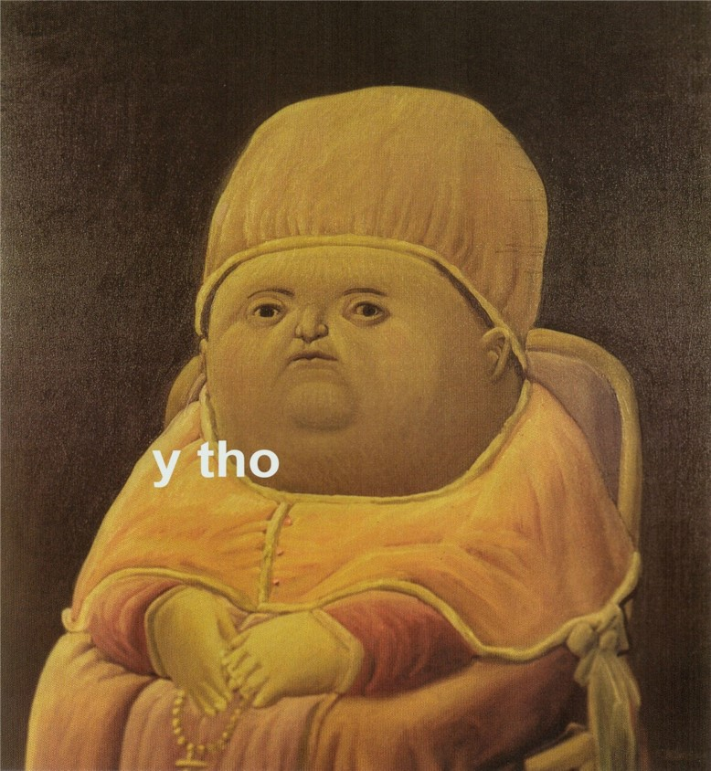
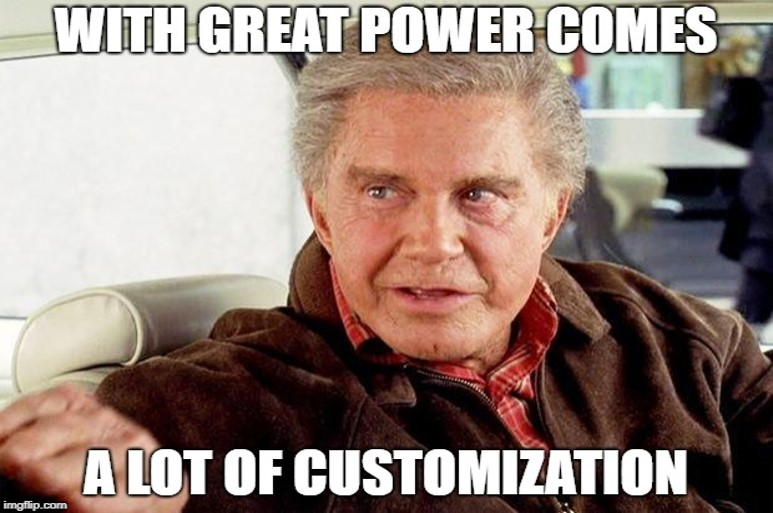

<style type="text/css">
body, td {
  font-size: 16px;
}
code.r{
  font-size: 14px;
}
</style>

```{r setup, include = FALSE}
knitr::opts_chunk$set(
  fig.width = 6, fig.height = 5, fig.retina = 2, fig.align = "center",
  out.width = "100%", dpi = 300,
  message = FALSE, warning = FALSE, cache = TRUE,
  autodep = TRUE, hiline = TRUE
)

knitr::opts_hooks$set(fig.callout = function(options) {
  if (options$fig.callout) {
    options$echo <- FALSE
    options$out.height <- "99%"
    options$fig.width <- 16
    options$fig.height <- 8
  }
  options
})

options(
  htmltools.dir.version = FALSE,
  width = 90,
  max.print = 9999,
  knitr.table.format = "html"
)

as_table <- function(...) knitr::kable(..., format = "html", digits = 3)
```

---
layout: false

class: inverse, center, middle

# Why *ggstatsplot*?
---

layout: true

# Raison d'être

---

--

.right-column[.font150[
Current count of number of packages on the Comprehensive R Archive Network (**CRAN**)<br>
**> 13,000**
]
.footnote[<https://cran.r-project.org/web/packages/>]
]

--

.left-column[

]

---

layout: true

# 1. Simpler data analysis workflow

---

--

.img-center[

]

--

<br>
<br>
<br>
<br>
<br>
<br>
<br>
<br>
In a typical *exploratory* data analysis workflow, <font color="blue">*data visualization*</font> and <font color="blue">*statistical modelling*</font> are two different phases: visualization informs modelling,
and modelling in its turn can suggest a different visualization method, and so
on and so forth. 

.footnote[(Grolemund & Wickham, *R for Data Science*, 2017)]

--

The central idea of **ggstatsplot** is simple: combine these two phases into one
in the form of graphics with statistical details, which makes data exploration
simpler and faster.

---

layout: true

# 2. Visualization is worth a thousand words

---

--

.img-center[

]


.footnote[(Matejka & Fitzmaurice, *Autodesk Research*, 2017)]

--

<br>
<br>
<br>
<br>
<br>
<br>
<br>
<br>
<br>
<br>
<br>
.font150[“I plotted my data and what I found will surprise me! - BuzzFeed”]

---

layout: false

# 3. Easier syntax 

--

The **grammar of graphics** (implemented in `ggplot2`) tells us that a statistical graphic is a <font color="blue">*mapping*</font> from data to <font color="blue">*aesthetic attributes*</font> (colour, shape, size) of <font color="blue">*geometric objects*</font> (points, lines, bars).

--

This means you can create any new graphics tailored for your problem. But...

--

.img-center-small[

]

--

The `ggstatsplot` package instead provides an **opinionated** collection of plots
for the most common statistical problems and, therefore, by design, is less
powerful.

---

layout: false

# 4. Consistent API

--

```{r lm, eval = FALSE}
stats::lm(formula = wt ~ mpg, data = mtcars)
```

--

```{r cor, eval = FALSE}
stats::cor(x = mtcars$wt, y = mtcars$mpg)
```

--

```{r cor.test, eval = FALSE}
stats::cor.test(formula = ~ wt + mpg, data = mtcars)
```

--

.img-right-small[

]

--

<br>
<br>
All functions in `ggstatsplot`-

1.  consistently rely on a dataframe (e.g., `data, x, y, ...`)
2.  accept both `"quoted"` and `unquoted` arguments

---

layout: false

class: inverse, center, middle

# Get Started

---

layout: false

# Installation

--

Install the **ggstatsplot** package from 
[CRAN](https://cran.r-project.org/web/packages/ggstatsplot/index.html):

```{r utils, eval = FALSE, tidy = FALSE}
utils::install.packages("ggstatsplot")
```
--

Then you can get the development version of the package from
[Github](https://github.com/IndrajeetPatil/ggstatsplot):

```{r github, eval = FALSE, tidy = FALSE}
devtools::install_github("IndrajeetPatil/ggstatsplot", dependencies = FALSE)
```

--

Load the needed packages-

```{r load, eval = TRUE, warning=FALSE}
library(ggstatsplot)
library(ggplot2)
```

--

You are recommended to use the [RStudioIDE](https://www.rstudio.com/products/rstudio/), 
but you do not have to.

---

layout: false

class: inverse, center, middle

# ggbetweenstats
For between group/condition comparisons

---

layout: true

# ggbetweenstats

---

.left-code[
```{r ggbetweenstats_1, eval = FALSE}
ggbetweenstats(
  data = movies_long,
  x = mpaa,
  y = rating,
  type = "p", # default #<<  
  bf.message = TRUE,
  messages = FALSE
)
```

.font80[
Changing the type of test

- `"p"` → **parametric**

- `"np"` → **non-parametric**

- `"r"` → **robust**

- `"bf"` → **bayes factor**
]
]

.right-plot[
```{r ggbetweenstats_1, ref.label = 'ggbetweenstats_1', echo = FALSE}
```
]

---

layout: true

# ggbetweenstats

---

.left-code[
```{r ggbetweenstats_2, eval = FALSE}
ggbetweenstats(
  data = movies_long,
  x = mpaa,
  y = rating,
  type = "np", #<<
  mean.ci = TRUE, #<<
  pairwise.comparisons = TRUE, #<<
  pairwise.display = "ns", #<<
  p.adjust.method = "fdr", #<<
  messages = FALSE
)
```
.font80[
Changing pairwise comparisons displayed

- `"ns"` → only **non-significant**

- `"s"` → only **significant**

- `"all"` → **everything**
]
]

.right-plot[
```{r ggbetweenstats_2, ref.label = 'ggbetweenstats_2', echo = FALSE}
```
]

---

layout: true

# ggbetweenstats

---

.left-code[
```{r ggbetweenstats_3, eval = FALSE}
ggbetweenstats(
  data = movies_long,
  x = mpaa,
  y = rating,
  type = "r", #<<
  pairwise.comparisons = TRUE,
  pairwise.annotation = "p", 
  outlier.tagging = TRUE, #<<
  outlier.label = title, #<<
  outlier.coef = 2, #<<
  ggtheme = hrbrthemes::theme_ipsum_tw(), #<<
  palette = "Darjeeling2", #<<
  package = "wesanderson", #<<
  messages = FALSE
)
```

.font80[
```r
Aesthetic preferences
are not an excuse to not
use `ggstatsplot` ;-)
```
]
]

.right-plot[
```{r ggbetweenstats_3, ref.label = 'ggbetweenstats_3', echo = FALSE}
```
]

---

layout: true

# ggbetweenstats

---

.left-code[
```{r ggbetweenstats_4, eval = FALSE}
ggbetweenstats(
  data = movies_long,
  x = mpaa,
  y = rating,
  type = "bf", #<<
  messages = FALSE
) + 
  scale_y_continuous(sec.axis = dup_axis()) #<<
```

.font80[
```r
Note: You can modify the
`ggstatsplot` plots further 
using `ggplot2` functions.
Yaay!
```
]

.img-left-small[

]

]

.right-plot[
```{r ggbetweenstats_4, ref.label = 'ggbetweenstats_4', echo = FALSE}
```
]

---

layout: false

class: inverse, center, middle

# ggscatterstats
Association between two numeric variables

---

layout: true

# ggscatterstats

---

.left-code[
```{r ggscatterstats_1, eval = FALSE}
ggscatterstats(
  data = movies_long,
  x = budget,
  y = rating,
  type = "p", # default #<<
  bf.message = TRUE, #<<
  messages = FALSE
)
```
.font80[
Changing the type of test

- `"p"` → **parametric**

- `"np"` → **non-parametric**

- `"r"` → **robust**

- `"bf"` → **bayes factor**
]
]

.right-plot[
```{r ggscatterstats_1, ref.label = 'ggscatterstats_1', echo = FALSE}
```
]

---

layout: true

# ggscatterstats

---

.left-code[
```{r ggscatterstats_2, eval = FALSE}
ggscatterstats(
  data = movies_long,
  x = budget,
  y = rating,
  marginal = FALSE, #<<
  method = "loess", #<<
  results.subtitle = FALSE, #<<
  centrality.para = "mean", #<<
  label.var = title, #<<
  label.expression = budget > 150 #<<
                     & rating > 7.5, #<<
  ggtheme = ggthemes::theme_stata(), #<<
  ggstatsplot.layer = FALSE,
  messages = FALSE
)
```

.font80[
Available centrality parameters

- **mean**

- **median**

]
]

.right-plot[
```{r ggscatterstats_2, ref.label = 'ggscatterstats_2', echo = FALSE}
```
]

---

layout: false

class: inverse, center, middle

# gghistostats
Distribution of a numeric variable

---

layout: false

class: inverse, center, middle

# ggdotplotstats
Distribution of a numeric variable with labels

---


layout: false

class: inverse, center, middle

# ggbarstats
For composition of categorical variables

---


layout: false

class: inverse, center, middle

# ggpiestats
For composition of categorical variables

---

layout: false

class: inverse, center, middle

# Glossary
Summary of statistical tests included
(as of 0.0.8.9000)

---

layout: false

# Pairwise comparison tests in ggbetweenstats

Type | Design | Equal variance? |  Test | *p*-value adjustment? 
----------- | --------- | --- | ------------------------- | --
Parametric | between | No | Games-Howell test | <font color="green">Yes</font>  
Parametric | between | Yes | Student's *t*-test | <font color="green">Yes</font>  
Parametric | within | `NA` | Student's *t*-test | <font color="green">Yes</font>  
Non-parametric | between | No | Dwass-Steel-Crichtlow-Fligner test | <font color="green">Yes</font>  
Non-parametric | within | No | Durbin-Conover test | <font color="green">Yes</font>  
Robust | between | No | Yuen's trimmed means test | <font color="green">Yes</font>  
Robust | within |`NA` | Yuen's trimmed means test | <font color="green">Yes</font>  
Bayes Factor | between | No | <font color="red">No</font> | <font color="red">No</font>
Bayes Factor | between | Yes | <font color="red">No</font> | <font color="red">No</font>
Bayes Factor | within | `NA` | <font color="red">No</font> | <font color="red">No</font>

---

layout: false

# Types of statistical analyses supported

Functions | Description | Parametric | Non-parametric | Robust | Bayes Factor
------- | ------------------ | ---- | ----- | ----| ----- 
`ggbetweenstats` | Between group/condition comparisons | <font color="green">Yes</font> | <font color="green">Yes</font> | <font color="green">Yes</font> | <font color="green">Yes</font>
`gghistostats`, `ggdotplotstats` | Distribution of a numeric variable | <font color="green">Yes</font> | <font color="green">Yes</font> | <font color="green">Yes</font> | <font color="green">Yes</font>
`ggcorrmat` | Correlation matrix | <font color="green">Yes</font> | <font color="green">Yes</font> | <font color="green">Yes</font> | <font color="red">No</font>
`ggscatterstats` | Correlation between two variables | <font color="green">Yes</font> | <font color="green">Yes</font> | <font color="green">Yes</font> | <font color="green">Yes</font>
`ggpiestats`, `ggbarstats` | Association between categorical variables | <font color="green">Yes</font> | <font color="red">No</font> | <font color="red">No</font> | <font color="green">Yes</font>
`ggcoefstats` | Regression model coefficients | <font color="green">Yes</font> | <font color="red">No</font>| <font color="green">Yes</font> | <font color="red">No</font>

---

layout: false

# remark.js

You can see an introduction of remark.js from [its homepage](https://remarkjs.com). You should read the [remark.js Wiki](https://github.com/gnab/remark/wiki) at least once to know how to

- create a new slide (Markdown syntax<sup>*</sup> and slide properties);

- format a slide (e.g. text alignment);

- configure the slideshow;

- and use the presentation (keyboard shortcuts).

It is important to be familiar with remark.js before you can understand the options in **xaringan**.

.footnote[[*] It is different with Pandoc's Markdown! It is limited but should be enough for presentation purposes. Come on... You do not need a slide for the Table of Contents! Well, the Markdown support in remark.js [may be improved](https://github.com/gnab/remark/issues/142) in the future.]

---
background-image: url(`r xaringan:::karl`)
background-size: cover
class: center, bottom, inverse

# I was so happy to have discovered remark.js!

---
class: inverse, middle, center

# Using xaringan

---

# xaringan

Provides an R Markdown output format `xaringan::moon_reader` as a wrapper for remark.js, and you can use it in the YAML metadata, e.g.

```yaml
---
title: "A Cool Presentation"
output:
  xaringan::moon_reader:
    yolo: true
    nature:
      autoplay: 30000
---
```

See the help page `?xaringan::moon_reader` for all possible options that you can use.

---

# remark.js vs xaringan

Some differences between using remark.js (left) and using **xaringan** (right):

.pull-left[
1. Start with a boilerplate HTML file;

1. Plain Markdown;

1. Write JavaScript to autoplay slides;

1. Manually configure MathJax;

1. Highlight code with `*`;

1. Edit Markdown source and refresh browser to see updated slides;
]

.pull-right[
1. Start with an R Markdown document;

1. R Markdown (can embed R/other code chunks);

1. Provide an option `autoplay`;

1. MathJax just works;<sup>*</sup>

1. Highlight code with `{{}}`;

1. The RStudio addin "Infinite Moon Reader" automatically refreshes slides on changes;
]

.footnote[[*] Not really. See next page.]

---

# Math Expressions

You can write LaTeX math expressions inside a pair of dollar signs, e.g. &#36;\alpha+\beta$ renders $\alpha+\beta$. You can use the display style with double dollar signs:

```
$$\bar{X}=\frac{1}{n}\sum_{i=1}^nX_i$$
```

$$\bar{X}=\frac{1}{n}\sum_{i=1}^nX_i$$

Limitations:

1. The source code of a LaTeX math expression must be in one line, unless it is inside a pair of double dollar signs, in which case the starting `$$` must appear in the very beginning of a line, followed immediately by a non-space character, and the ending `$$` must be at the end of a line, led by a non-space character;

1. There should not be spaces after the opening `$` or before the closing `$`.

1. Math does not work on the title slide (see [#61](https://github.com/yihui/xaringan/issues/61) for a workaround).

---

# R Code

```{r comment='#'}
# a boring regression
fit = lm(dist ~ 1 + speed, data = cars)
coef(summary(fit))
dojutsu = c('地爆天星', '天照', '加具土命', '神威', '須佐能乎', '無限月読')
grep('天', dojutsu, value = TRUE)
```

---

# R Plots

```{r cars, fig.height=4, dev='svg'}
par(mar = c(4, 4, 1, .1))
plot(cars, pch = 19, col = 'darkgray', las = 1)
abline(fit, lwd = 2)
```

---

# Tables

If you want to generate a table, make sure it is in the HTML format (instead of Markdown or other formats), e.g.,

```{r}
knitr::kable(head(iris), format = 'html')
```

---

# HTML Widgets

I have not thoroughly tested HTML widgets against **xaringan**. Some may work well, and some may not. It is a little tricky.

Similarly, the Shiny mode (`runtime: shiny`) does not work. I might get these issues fixed in the future, but these are not of high priority to me. I never turn my presentation into a Shiny app. When I need to demonstrate more complicated examples, I just launch them separately. It is convenient to share slides with other people when they are plain HTML/JS applications.

See the next page for two HTML widgets.

---

```{r out.width='100%', fig.height=6, eval=require('leaflet')}
library(leaflet)
leaflet() %>% addTiles() %>% setView(-93.65, 42.0285, zoom = 17)
```

---

```{r eval=require('DT'), tidy=FALSE}
DT::datatable(
  head(iris, 10),
  fillContainer = FALSE, options = list(pageLength = 8)
)
```

---

# Some Tips

- When you use the "Infinite Moon Reader" addin in RStudio, your R session will be blocked by default. You can click the red button on the right of the console to stop serving the slides, or use the _daemonized_ mode so that it does not block your R session. To do the latter, you can set the option

    ```r
    options(servr.daemon = TRUE)
    ```
    
    in your current R session, or in `~/.Rprofile` so that it is applied to all future R sessions. I do the latter by myself.
    
    To know more about the web server, see the [**servr**](https://github.com/yihui/servr) package.

--

- Do not forget to try the `yolo` option of `xaringan::moon_reader`.

    ```yaml
    output:
      xaringan::moon_reader:
        yolo: true
    ```

---

# Some Tips

- Slides can be automatically played if you set the `autoplay` option under `nature`, e.g. go to the next slide every 30 seconds in a lightning talk:

    ```yaml
    output:
      xaringan::moon_reader:
        nature:
          autoplay: 30000
    ```

--

- A countdown timer can be added to every page of the slides using the `countdown` option under `nature`, e.g. if you want to spend one minute on every page when you give the talk, you can set:

    ```yaml
    output:
      xaringan::moon_reader:
        nature:
          countdown: 60000
    ```

    Then you will see a timer counting down from `01:00`, to `00:59`, `00:58`, ... When the time is out, the timer will continue but the time turns red.
    
---

# Some Tips

- The title slide is created automatically by **xaringan**, but it is just another remark.js slide added before your other slides.

    The title slide is set to `class: center, middle, inverse, title-slide` by default. You can change the classes applied to the title slide with the `titleSlideClass` option of `nature` (`title-slide` is always applied).

    ```yaml
    output:
      xaringan::moon_reader:
        nature:
          titleSlideClass: [top, left, inverse]
    ```
    
--

- If you'd like to create your own title slide, disable **xaringan**'s title slide with the `seal = FALSE` option of `moon_reader`.

    ```yaml
    output:
      xaringan::moon_reader:
        seal: false
    ```

---

# Some Tips

- There are several ways to build incremental slides. See [this presentation](https://slides.yihui.name/xaringan/incremental.html) for examples.

- The option `highlightLines: true` of `nature` will highlight code lines that start with `*`, or are wrapped in `{{ }}`, or have trailing comments `#<<`;

    ```yaml
    output:
      xaringan::moon_reader:
        nature:
          highlightLines: true
    ```

    See examples on the next page.

---

# Some Tips


.pull-left[
An example using a leading `*`:

    ```r
    if (TRUE) {
    ** message("Very important!")
    }
    ```
Output:
```r
if (TRUE) {
* message("Very important!")
}
```

This is invalid R code, so it is a plain fenced code block that is not executed.
]

.pull-right[
An example using `{{}}`:

    `r ''````{r tidy=FALSE}
    if (TRUE) {
    *{{ message("Very important!") }}
    }
    ```
Output:
```{r tidy=FALSE}
if (TRUE) {
{{ message("Very important!") }}
}
```

It is valid R code so you can run it. Note that `{{}}` can wrap an R expression of multiple lines.
]

---

# Some Tips

An example of using the trailing comment `#<<` to highlight lines:

````markdown
`r ''````{r tidy=FALSE}
library(ggplot2)
ggplot(mtcars) + 
  aes(mpg, disp) + 
  geom_point() +   #<<
  geom_smooth()    #<<
```
````

Output:

```{r tidy=FALSE, eval=FALSE}
library(ggplot2)
ggplot(mtcars) + 
  aes(mpg, disp) + 
  geom_point() +   #<<
  geom_smooth()    #<<
```

---

# Some Tips

When you enable line-highlighting, you can also use the chunk option `highlight.output` to highlight specific lines of the text output from a code chunk. For example, `highlight.output = TRUE` means highlighting all lines, and `highlight.output = c(1, 3)` means highlighting the first and third line.

````md
`r ''````{r, highlight.output=c(1, 3)}
head(iris)
```
````

```{r, highlight.output=c(1, 3), echo=FALSE}
head(iris)
```

Question: what does `highlight.output = c(TRUE, FALSE)` mean? (Hint: think about R's recycling of vectors)

---

# Some Tips

- To make slides work offline, you need to download a copy of remark.js in advance, because **xaringan** uses the online version by default (see the help page `?xaringan::moon_reader`).

- You can use `xaringan::summon_remark()` to download the latest or a specified version of remark.js. By default, it is downloaded to `libs/remark-latest.min.js`.

- Then change the `chakra` option in YAML to point to this file, e.g.

    ```yaml
    output:
      xaringan::moon_reader:
        chakra: libs/remark-latest.min.js
    ```

- If you used Google fonts in slides (the default theme uses _Yanone Kaffeesatz_, _Droid Serif_, and _Source Code Pro_), they won't work offline unless you download or install them locally. The Heroku app [google-webfonts-helper](https://google-webfonts-helper.herokuapp.com/fonts) can help you download fonts and generate the necessary CSS.

---

# Macros

- remark.js [allows users to define custom macros](https://github.com/yihui/xaringan/issues/80) (JS functions) that can be applied to Markdown text using the syntax `![:macroName arg1, arg2, ...]` or ``. For example, before remark.js initializes the slides, you can define a macro named `scale`:

    ```js
    remark.macros.scale = function (percentage) {
      var url = this;
      return '';
    };
    ```

    Then the Markdown text

    ```markdown
    
    ```

    will be translated to
    
    ```html
    
    ```

---

# Macros (continued)

- To insert macros in **xaringan** slides, you can use the option `beforeInit` under the option `nature`, e.g.,

    ```yaml
    output:
      xaringan::moon_reader:
        nature:
          beforeInit: "macros.js"
    ```

    You save your remark.js macros in the file `macros.js`.

- The `beforeInit` option can be used to insert arbitrary JS code before `remark.create()`. Inserting macros is just one of its possible applications.

---

# CSS

Among all options in `xaringan::moon_reader`, the most challenging but perhaps also the most rewarding one is `css`, because it allows you to customize the appearance of your slides using any CSS rules or hacks you know.

You can see the default CSS file [here](https://github.com/yihui/xaringan/blob/master/inst/rmarkdown/templates/xaringan/resources/default.css). You can completely replace it with your own CSS files, or define new rules to override the default. See the help page `?xaringan::moon_reader` for more information.

---

# CSS

For example, suppose you want to change the font for code from the default "Source Code Pro" to "Ubuntu Mono". You can create a CSS file named, say, `ubuntu-mono.css`:

```css
@import url(https://fonts.googleapis.com/css?family=Ubuntu+Mono:400,700,400italic);

.remark-code, .remark-inline-code { font-family: 'Ubuntu Mono'; }
```

Then set the `css` option in the YAML metadata:

```yaml
output:
  xaringan::moon_reader:
    css: ["default", "ubuntu-mono.css"]
```

Here I assume `ubuntu-mono.css` is under the same directory as your Rmd.

See [yihui/xaringan#83](https://github.com/yihui/xaringan/issues/83) for an example of using the [Fira Code](https://github.com/tonsky/FiraCode) font, which supports ligatures in program code.

---

# Themes

Don't want to learn CSS? Okay, you can use some user-contributed themes. A theme typically consists of two CSS files `foo.css` and `foo-fonts.css`, where `foo` is the theme name. Below are some existing themes:

```{r}
names(xaringan:::list_css())
```

---

# Themes

To use a theme, you can specify the `css` option as an array of CSS filenames (without the `.css` extensions), e.g.,

```yaml
output:
  xaringan::moon_reader:
    css: [default, metropolis, metropolis-fonts]
```

If you want to contribute a theme to **xaringan**, please read [this blog post](https://yihui.name/en/2017/10/xaringan-themes).

---
class: inverse, middle, center
background-image: url(https://upload.wikimedia.org/wikipedia/commons/3/39/Naruto_Shiki_Fujin.svg)
background-size: contain

# Naruto

---
background-image: url(https://upload.wikimedia.org/wikipedia/commons/b/be/Sharingan_triple.svg)
background-size: 100px
background-position: 90% 8%

# Sharingan

The R package name **xaringan** was derived<sup>1</sup> from **Sharingan**, a dōjutsu in the Japanese anime _Naruto_ with two abilities:

- the "Eye of Insight"

- the "Eye of Hypnotism"

I think a presentation is basically a way to communicate insights to the audience, and a great presentation may even "hypnotize" the audience.<sup>2,3</sup>

.footnote[
[1] In Chinese, the pronounciation of _X_ is _Sh_ /ʃ/ (as in _shrimp_). Now you should have a better idea of how to pronounce my last name _Xie_.

[2] By comparison, bad presentations only put the audience to sleep.

[3] Personally I find that setting background images for slides is a killer feature of remark.js. It is an effective way to bring visual impact into your presentations.
]

---

# Naruto terminology

The **xaringan** package borrowed a few terms from Naruto, such as

- [Sharingan](http://naruto.wikia.com/wiki/Sharingan) (写輪眼; the package name)

- The [moon reader](http://naruto.wikia.com/wiki/Moon_Reader) (月読; an attractive R Markdown output format)

- [Chakra](http://naruto.wikia.com/wiki/Chakra) (查克拉; the path to the remark.js library, which is the power to drive the presentation)

- [Nature transformation](http://naruto.wikia.com/wiki/Nature_Transformation) (性質変化; transform the chakra by setting different options)

- The [infinite moon reader](http://naruto.wikia.com/wiki/Infinite_Tsukuyomi) (無限月読; start a local web server to continuously serve your slides)

- The [summoning technique](http://naruto.wikia.com/wiki/Summoning_Technique) (download remark.js from the web)

You can click the links to know more about them if you want. The jutsu "Moon Reader" may seem a little evil, but that does not mean your slides are evil.

---

class: center

# Hand seals (印)

Press `h` or `?` to see the possible ninjutsu you can use in remark.js.


---

class: center, middle

# Thanks!

Slides created via the R package [**xaringan**](https://github.com/yihui/xaringan).

The CSS template comes from [Garrick Aden-Buie](https://github.com/gadenbuie/gentle-ggplot2).

---
class: inverse, center, middle

# Thanks!

.font150.text-white[
@patilindrajeets <br>
github.com/IndrajeetPatil <br>
patilindrajeet.science@gmail.com
]
